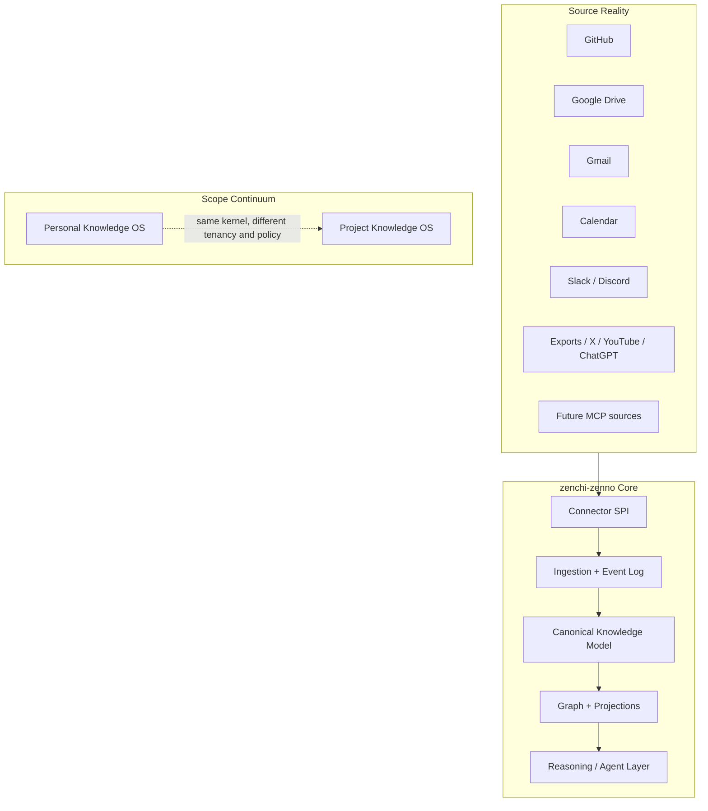
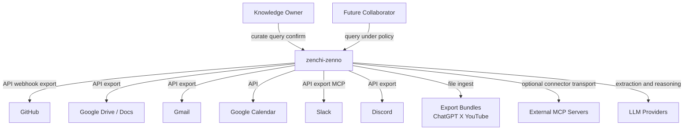
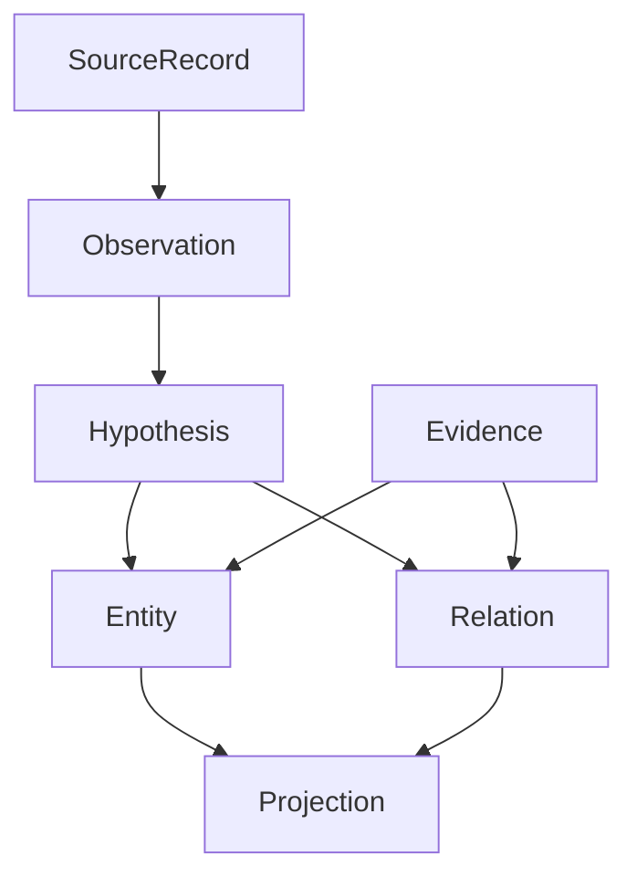
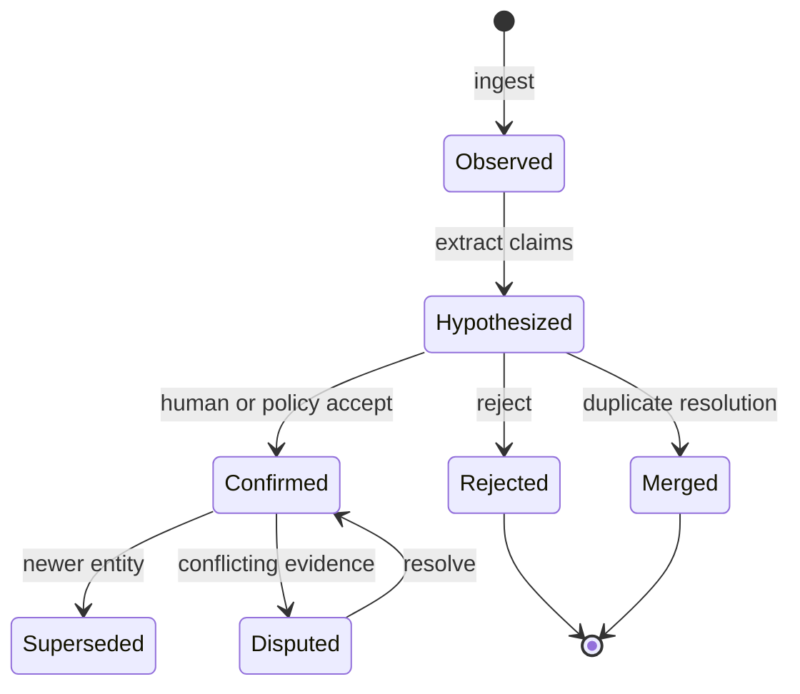
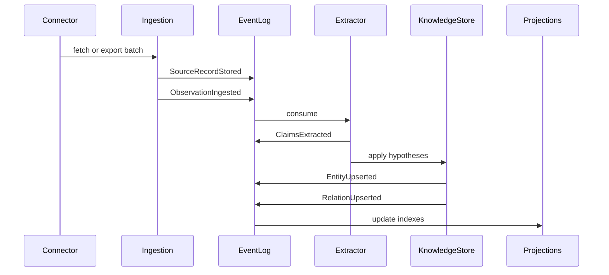
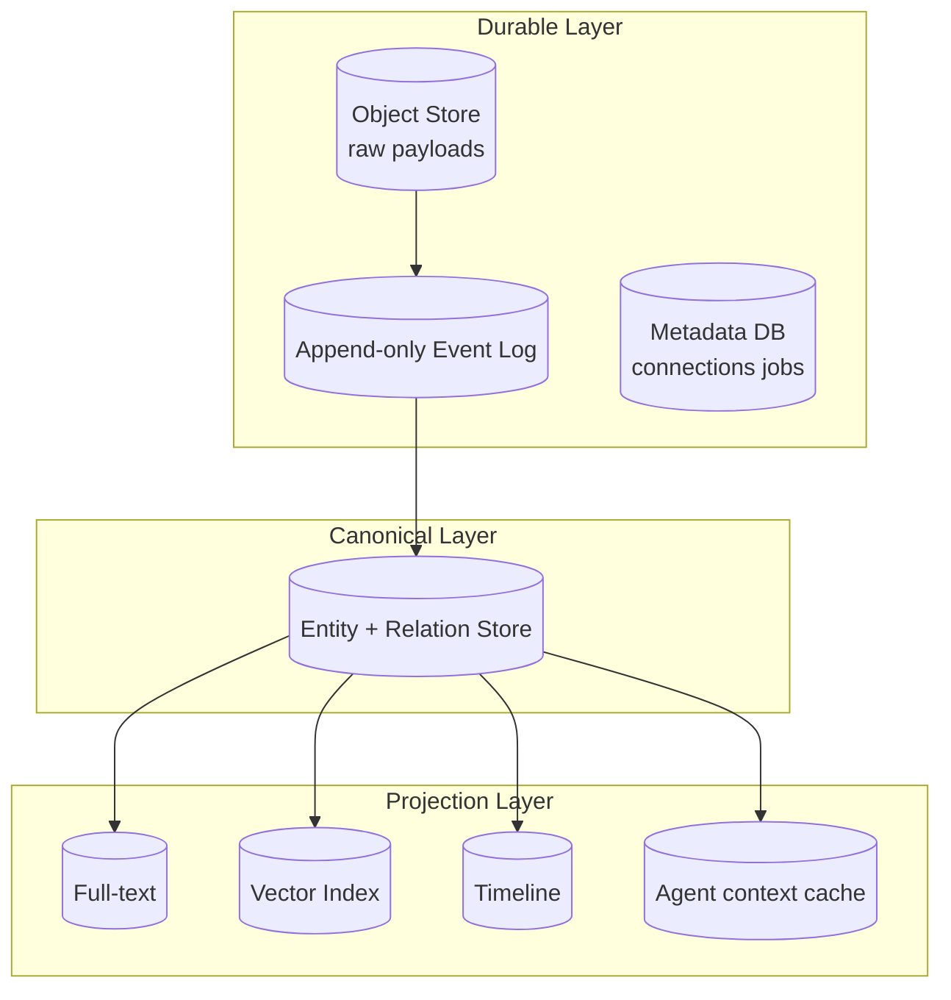
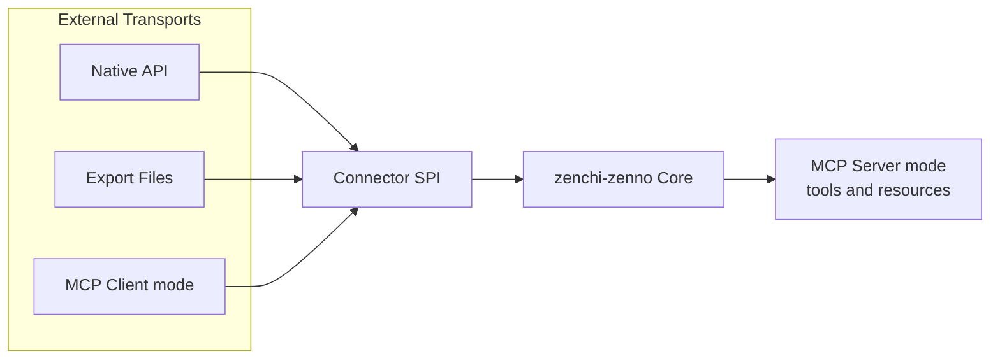
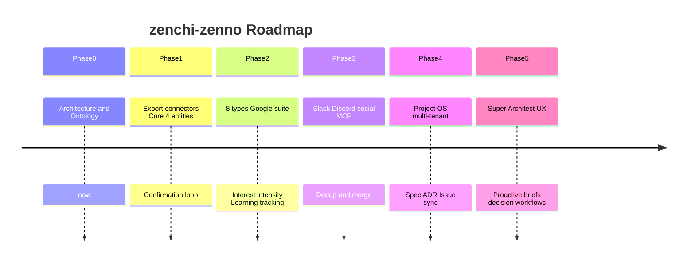
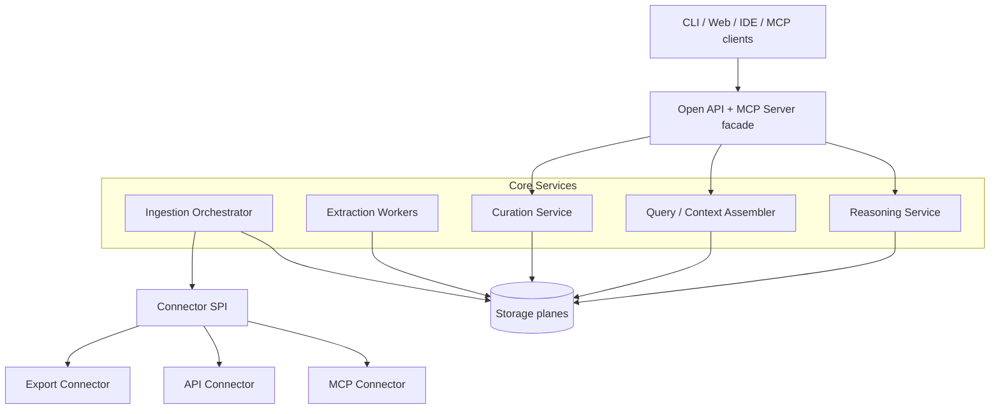

> **日本語版**（正本は英語: [ARCHITECTURE.md](ARCHITECTURE.ja.md)）。解釈が異なる場合は英語版を優先します。
>
> [English](ARCHITECTURE.ja.md) | 日本語

<a id="zenchi-zenno-architecture"></a>

# zenchi-zenno アーキテクチャ

**ドキュメントのステータス:** ドラフト v0.3（フェーズ 1 — 個人 MVP **usable**; Phase 1→2 ゲートは Personal で通過）
**コード名:** zenchi-zenno
**スコープの連続体:** Personal Knowledge OS → Project Knowledge OS
**最上位目標:** ソースに依存しないナレッジ オペレーティング システムで、初日から存在するスーパー アーキテクトのように動作します。
**商業境界:** [commercial-boundary.md](commercial-boundary.ja.md) · [license-strategy.md](license-strategy.ja.md)
**エージェントスキル:** [agent-skill-decision-trace.md](agent-skill-decision-trace.ja.md)

---

<a id="table-of-contents"></a>

## 目次

1. [製品ビジョン](#1-product-vision)
2. [システムコンテキスト](#2-system-context)
3. [コアドメイン設計](#3-core-domain-design)
4. [ユビキタス言語](#4-ubiquitous-language)
5. [知識モデル](#5-knowledge-model)
6. [Event モデル](#6-event-model)
7. [ストレージ設計](#7-storage-design)
8. [MCP 統合戦略](#8-mcp-integration-strategy)
9. [OSS 差別化](#9-oss-differentiation)
10. [MVP スコープ](#10-mvp-scope)
11. [段階的ロードマップ](#11-phased-roadmap)

**詳細な仕様:** [knowledge-model.md](knowledge-model.ja.md) · [event-model.md](event-model.ja.md) · [connector-spi.md](connector-spi.ja.md) · [ubiquitous-language.md](ubiquitous-language.ja.md) · [commercial-boundary.md](commercial-boundary.ja.md)

---

<a id="design-thesis"></a>

## 設計の基本命題

RAG は、製品センターではなく、検索メカニズムの 1 つです。 zenchi-zenno は 3 つのレイヤーで構成されています。

1. **Source Reality** — 生のペイロードと出所 (決して破棄されない)
2. **Canonical Knowledge** — 正規化された `Decision`、`Idea`、`Project`、`Person`、`Interest`、`Learning`、`Artifact`、`Event` オブジェクト
3. **Cognitive Interface** — 長年勤務したスーパーアーキテクトとしての解釈、推論、対話

API、Export、および MCP はすべて **アダプター** です。ドメイン モデルとストレージ契約が信頼できる唯一の情報源です。



---

<a id="1-product-vision"></a>

## 1. 製品のビジョン

<a id="vision-statement"></a>

### ビジョンステートメント

> **zenchi-zenno は、散在するアクティビティ信号を共有知識概念に継続的に正規化し、個人 (およびその後のプロジェクト) のコンテキスト、意思決定、学習を再利用可能にします。あたかもスーパーアーキテクトが最初から存在していたかのようにです。**

<a id="what-it-is-is-not"></a>

### それは何なのか / そうではないのか

| です                                                      | そうではありません                          |
| --------------------------------------------------------- | ------------------------------------------- |
| 正規化された知識オブジェクトのライフサイクル管理          | すべてをチャット モデルにダンプするラッパー |
| Event を源とする時間の経過による知識の進化                | 単一ベンダーのナレッジ ベース               |
| Personal から Project OS までスケールするカーネル         | コラボレーション ツール自体の代替品         |
| Connector - プラグイン可能なオープン インフラストラクチャ | MCP 専用のランタイム                        |

<a id="user-outcomes"></a>

### ユーザーの成果

**個人的な（現在）**

- _いつ_、*どのような証拠に基づいて*意思決定が行われたかを追跡する
- 異種ソース間で `Idea`、`Interest`、および `Learning` を接続する
- あなたが書いたもの、読んだもの、議論したもの、視聴したものから現在の興味の構造を確認する

**Project (将来)**

- 要件、設計ドキュメント、会議メモ、問題、Slack、および Git を 1 つのモデルに統合します
- 新人と後任のエージェントに、Decision グラフを使用して _状況が現状である理由_ を説明させます
- テナントと ACL を含む組織ポリシーに基づいて同じカーネルを適用します。

<a id="design-principles"></a>

### 設計原則

1. **おしゃべりよりも正規** — 第一級市民はチャット ログではなく知識オブジェクトです
2. **出所は神聖です** — 生の情報源は保持されます。すべての主張は証拠にリンクしています
3. **前提ではなくアダプター** — 取り込みトランスポートがドメインを形成してはなりません
4. **個人第一、Project 対応** — テナンシー、ACL、およびレビューが最初から設計されています
5. **人間による確認ループ** — 抽出により仮説が生成されます。 `Decision` および同様のタイプは確認が必要です
6. **Projection 多様性** — グラフ、フルテキスト、ベクター、タイムラインはすべて派生ビューです

---

<a id="2-system-context"></a>

## 2. システムコンテキスト



<a id="context-boundaries"></a>

### コンテキスト境界

**zenchi-zenno 内**

- Connector SPI、取り込みオーケストレーション、イベント ログ
- 正準知識グラフ、射影インデックス
- ポリシー、ワークスペース境界、エージェント API

**zenchi-zenno外**

- SaaS プラットフォーム、MCP サーバー実装、LLM ベンダー
- クライアント UI (CLI、Web、IDE、MCP クライアント - すべてのコンシューマー)

---

<a id="3-core-domain-design"></a>

## 3. コアドメインの設計

<a id="bounded-contexts"></a>

### 境界のあるコンテキスト

```mermaid
flowchart LR
  subgraph ingestion [Ingestion Context]
    Conn[Connector]
    Norm[Source Normalizer]
    Dedup[Idempotency / Dedup]
  end

  subgraph knowledge [Knowledge Context]
    Ent[Entity Lifecycle]
    Rel[Relation Graph]
    Ext[Extraction Hypotheses]
    Cur[Curation / Confirmation]
  end

  subgraph temporal [Temporal / Event Context]
    EL[Append-only Event Log]
    TL[Timeline Projections]
  end

  subgraph cognition [Cognition Context]
    Q[Query Plans]
    R[Reasoning Episodes]
    Mem[Working Context Assembly]
  end

  subgraph policy [Identity and Policy Context]
    Ten[Tenancy]
    ACL[ACL / Sensitivity]
    Cons[Consent and Retention]
  end

  ingestion --> temporal
  temporal --> knowledge
  knowledge --> cognition
  policy -.-> ingestion
  policy -.-> knowledge
  policy -.-> cognition
```



<a id="aggregates"></a>

### 集計

| 集計               | 責任                                                  |
| ------------------ | ----------------------------------------------------- |
| `SourceConnection` | Connector 設定、認証、同期カーソル                    |
| `SourceRecord`     | 生のペイロードへの不変スナップショット参照            |
| `Observation`      | ある時点での「見られたもの」を正規化                  |
| `KnowledgeEntity`  | 型付き正規オブジェクト (`Decision`、`Idea`、…)        |
| `Relation`         | エンティティまたは証拠間の型付きセマンティック リンク |
| `CurationAction`   | 人間またはポリシーの確認、拒否、マージ                |
| `ReasoningEpisode` | エージェントが何を参照し結論付けたかの監査可能な記録  |

Personal と Project の主な違いは、**ポリシー コンテキスト + テナント**です。 Entity タイプは共有されています。

<a id="core-invariant"></a>

### コアの不変条件

> **すべての Claim は 1 つ以上の Evidence レコードにリンクし、信頼性スコアを保持し、確認状態を持ちます。**

---

<a id="4-ubiquitous-language"></a>

## 4. ユビキタス言語

[ubiquitous-language.md](ubiquitous-language.ja.md) の完全な用語集を参照してください。

<a id="critical-distinctions-do-not-conflate"></a>

### 重要な違い (混同しないでください)

| 用語                   | 意味                                                          |
| ---------------------- | ------------------------------------------------------------- |
| `Observation`          | ソースで観察されたファクト (コミット、電子メール、メッセージ) |
| `Entity`               | 正規化された正規化された知識 (`Decision`、`Artifact`、…)      |
| `Domain Event`         | 内部追加専用システム ファクト (`ObservationIngested`, …)      |
| `Event` (エンティティ) | ユーザー向けの出来事 (会議、リリース、会話セッション)         |
| `Evidence`             | クレームまたはエンティティから `Observation`                  | へのリンクを戻す |
| `Hypothesis`           | 自信を持って未確認の主張                                      |
| `Confirmation`         | 仮説を受け入れる、拒否する、または結合するアクション          |

---

<a id="5-knowledge-model"></a>

## 5. 知識モデル

このセクションは建築センターです。フィールドレベルの詳細については、[knowledge-model.md](knowledge-model.ja.md) を参照してください。

<a id="51-design-intent"></a>

### 5.1 設計意図

ソース固有のスキーマ (`Commit`、`DriveFile`、`SlackMessage`) をアプリケーション センターにすることはできません。これらは **Observation タイプ**のままです。意味は共有 Entity 型に存在します。



<a id="52-entity-type-system"></a>

### 5.2 Entity 型システム

すべてのエンティティは共通のヘッダーを共有します。

| フィールド                  | 意味                                                                    |
| --------------------------- | ----------------------------------------------------------------------- |
| `id`                        | ULID または UUID                                                        |
| `workspace_id`              | 個人境界または Project 境界                                             |
| `type`                      | 8 つの標準タイプの 1 つ                                                 |
| `title`                     | 人間が読める短い名前                                                    |
| `summary`                   | 1 段落の現在の概要 (キャッシュされたプロジェクションの可能性があります) |
| `status`                    | タイプ固有のライフサイクル状態                                          |
| `sensitivity`               | `private`、`shareable`、`restricted`、…                                 |
| `confidence`                | 抽出由来の場合は 0 ～ 1                                                 |
| `confirmation_state`        | `hypothesized`、`confirmed`、`disputed`、`archived`                     |
| `valid_from` / `valid_to`   | 有効時間（知識が保持されていたとき）                                    |
| `created_at` / `updated_at` | システム時間                                                            |
| `aliases`                   | 表面形状のバリエーション                                                |
| `tags`                      | 軽量ラベル (`Interest` とは異なります)                                  |
| `evidence_refs`             | Evidence への参照                                                       |
| `provenance`                | エクストラクタ モデル、プロンプト バージョン、コネクタ バージョン       |

<a id="the-eight-canonical-types"></a>

#### 8 つの標準タイプ

| タイプ       | 役割                                              | 一般的なステータス フロー                                      |
| ------------ | ------------------------------------------------- | -------------------------------------------------------------- |
| **Decision** | 根拠と代替案を含む採択された結論                  | `proposed` → `accepted` → `superseded` / `retracted`           |
| **Idea**     | 未採用または検討中のコンセプト                    | `captured` → `exploring` → `promoted` / `parked` / `discarded` |
| **Project**  | 境界付きイニシアチブコンテナ                      | `active` → `paused` / `completed` / `abandoned`                |
| **Person**   | 人間または安定したエージェントのアイデンティティ  | 仮説→確認によるアイデンティティ解決                            |
| **Interest** | 持続的なトピックまたは注目の領域                  | `emerging` → `active` → `waning` / `archived`                  |
| **Learning** | 理解を得た記録                                    | `noted` → `practiced` → `internalized`                         |
| **Artifact** | 耐久性のある出力 (ドキュメント、コード、メモ、図) | `draft` → `active` → `deprecated` / `deleted_at_source`        |
| **Event**    | 期限付きのイベント (会議、リリース、セッション)   | `scheduled` → `occurred` / `cancelled`                         |

<a id="decision-expanded"></a>

#### Decision (展開済み)

Decision は概要ではなく、採用された選択肢です。

- **必須セマンティクス:** `rationale`、`alternatives[]`、`decided_at`、`impact_scope`、`decision_makers[]`
- **典型的な証拠:** 会議メモ、ADR、問題のコメント、Slack スレッド、設計ドキュメントの差分
- **進化:** `supersedes` 関係を介した新しい Decision に置き換えられました

<a id="idea-expanded"></a>

#### Idea (展開済み)

- 5 月 `promoted_to` から Decision
- Interest または Project の周囲にクラスターが発生することが多い

<a id="project-expanded"></a>

#### Project (展開済み)

- 個人の範囲は有効です (例: 「就職活動」、「副業 X」)
- `belongs_to` 経由でアーティファクト、決定、イベントをバンドルします

<a id="53-relation-model"></a>

### 5.3 Relation モデル

リレーションは型付けされており、`confirmation_state` および `evidence_refs` を持ちます。

| 述語              | から → へ                                        | 意味                    |
| ----------------- | ------------------------------------------------ | ----------------------- |
| `evidences`       | Evidence → Entity / Relation                     | 接地リンク              |
| `derived_from`    | Entity → Observation / Entity                    | 来歴                    |
| `about`           | Event / Artifact / Learning → Interest / Project | 主題                    |
| `produced`        | Person / Project → Artifact                      | 創造                    |
| `participated_in` | Person → Event                                   | 出席または関与          |
| `decides_for`     | Decision → Project / Artifact                    | 適用範囲                |
| `supersedes`      | Decision → Decision                              | 交換                    |
| `promoted_to`     | Idea → Decision                                  | プロモーション          |
| `related_to`      | * ↔ *                                            | 弱い関連性 (慎重に使用) |
| `mentions`        | Observation → Person / Artifact                  | 信頼性の低い言及        |
| `learns`          | Person → Learning                                | Learning 件名           |
| `contradicts`     | Claim / Decision ↔ Claim / Decision              | 紛争                    |
| `belongs_to`      | * → Project / Workspace                          | 封じ込め                |

<a id="54-observation-model-pre-canonical"></a>

### 5.4 Observation モデル (正規化前)

```text
Observation {
  id, source_system, source_type, source_native_id,
  observed_at, ingested_at,
  actor?: PersonRefHypothesis,
  title?, text?, structured?,
  pointers: { url?, thread_id?, repo?, path?, message_id? },
  content_ref,   // SourceRecord
  checksum, localization, language?
}
```

<a id="55-source-observation-entity-mapping"></a>

### 5.5 ソース → Observation → Entity マッピング

| ソースオブジェクト   | Observation タイプ | 主要エンティティ候補                                             |
| -------------------- | ------------------ | ---------------------------------------------------------------- |
| Git コミット         | `code.change`      | Artifact、Event、Learning?、Decision? (メッセージが明示的な場合) |
| PR+レビュー          | `code.review`      | Decision、Artifact、Person                                       |
| ドライブドキュメント | `doc.revision`     | Artifact、Idea、Decision (抽出経由)                              |
| 会議メモ             | `meeting.notes`    | Event、Decision、Person、Project                                 |
| Slack スレッド       | `chat.thread`      | Event、Idea、Decision (候補)、Person                             |
| カレンダーエントリー | `calendar.event`   | Event、Person、Project                                           |
| 電子メール           | `email.message`    | Event、Person、Idea / Decision (再現率が低い)                    |
| ChatGPT エクスポート | `ai.conversation`  | Idea、Learning、Decision (候補)、Interest                        |
| YouTube 履歴         | `media.view`       | Event、Interest、Learning                                        |
| X 投稿/ブックマーク  | `social.post`      | Interest、Idea、Person                                           |

<a id="56-extraction-rule-critical"></a>

### 5.6 抽出ルール (重要)

> **単一の Slack メッセージは Decision ではありません。**

抽出すると `Hypothesis(Decision)` (または Idea) が作成されます。昇進には、裏付けとなる証拠、明示的な意思決定言語、または人間の Confirmation が必要です。

<a id="57-confirmation-state-machine"></a>

### 5.7 Confirmation ステートマシン



エージェントの動作:

- 回答では **確認済み** エンティティを優先します
- **仮説**の主張を明示的にラベル付けします
- 仮説を事実として決して提示しない

<a id="58-entity-relationship-overview"></a>

### 5.8 Entity-関係の概要

```mermaid
erDiagram
  WORKSPACE ||--o{ ENTITY : contains
  ENTITY ||--o{ ENTITY_VERSION : versions
  ENTITY ||--o{ RELATION : from
  ENTITY ||--o{ RELATION : to
  OBSERVATION ||--o{ EVIDENCE : supports
  EVIDENCE }o--|| ENTITY : evidences
  EVIDENCE }o--o| RELATION : evidences
  SOURCE_RECORD ||--o{ OBSERVATION : materializes
  ENTITY ||--o{ PROJECTION_REF : indexed_as
```

<a id="59-personal-project-evolution"></a>

### 5.9 個人 → Project の進化

同じエンティティ タイプ。 Project フェーズの追加:

- `WorkspaceKind`: `personal` | `project`
- 共有ポリシー、特定の決定に対する必須レビュー、PII 編集
- オプションのサブタイプ: Decision または Artifact の特殊化としての `Requirement`、`Risk`、`ADR`
- マルチアクター Confirmation (単一所有者の仮定を緩和)

---

<a id="6-event-model"></a>

## 6. Event モデル

完全なカタログについては、[event-model.md](event-model.ja.md) を参照してください。

<a id="two-event-concepts-strict-separation"></a>

### 2 つのイベント概念 (厳密な分離)

| コンセプト             | レイヤー             | 例                                        |
| ---------------------- | -------------------- | ----------------------------------------- |
| **Domain Event**       | システム追加専用ログ | `ObservationIngested`                     |
| **Event エンティティ** | 正規の知識           | 「2026 年 3 月 1 日のスプリント計画会議」 |

<a id="ingestion-sequence"></a>

### 取り込みシーケンス



<a id="idempotency-key"></a>

### べき等性キー

```
(workspace_id, source_system, source_native_id, content_checksum)
```

再取り込みではエンティティを複製してはなりません。再抽出により、バージョン メタデータを含む新しい `ClaimsExtracted` イベントが発行されます。

---

<a id="7-storage-design"></a>

## 7. ストレージ設計



| ストア             | 役割                         | 実施スタンス                                                |
| ------------------ | ---------------------------- | ----------------------------------------------------------- |
| オブジェクトストア | 不変の `SourceRecord` ボディ | S3 互換またはローカル ファイル システム                     |
| Event ログ         | ドメインイベント             | Postgres 追加テーブル、NATS、またはファイル ログ - 交換可能 |
| メタデータDB       | 接続、ジョブ、カーソル       | OLTP                                                        |
| Entity ストア      | 現在のグラフの状態           | Postgres + JSONB またはプロパティ グラフ — TBD              |
| 全文               | 語彙検索                     | Postgres FTS または OpenSearch                              |
| ベクトル           | 類似性 (非正規)              | pgvector、sqlite-vec、Qdrant — 交換可能                     |
| ローカルファースト | 単一マシンの展開             | すべてのレイヤーが埋め込み可能 (OSS 要件)                   |

<a id="storage-principles"></a>

### 保管の原則

1. **Raw は不変** — 削除はサイレント消去ではなく、ポリシー主導の廃棄です。
2. **ベクトルは真実ではありません** — 埋め込みはプロジェクションです
3. **イベントによるスキーマの進化** — バージョン管理されたクレームはモデルの変更を存続します
4. **初日からの暗号化とワークスペースの分離**
5. **エクスポート可能性** — ユーザーは正規の知識と来歴をエクスポートできます。

<a id="personal-project-in-storage"></a>

### 個人 → Project がストレージにあります

- `workspace_id` はすべての永続データをパーティション化します
- ポリシー コンテキストはクエリと取り込みの境界で ACL を強制します
- 同じ実店舗。ワークスペース + 機密性による論理的分離

---

<a id="8-mcp-integration-strategy"></a>

## 8. MCP 統合戦略

MCP は **ファーストクラス トランスポート**であり、**ファーストクラス ドメイン**ではありません。



<a id="two-faces-of-mcp"></a>

### MCP の 2 つの顔

**Ingress** — zenchi-zenno は、Connector 実装内で MCP クライアントとして機能します。安定した API が存在しない場合に便利です。

**出力** — zenchi-zenno は、次のようなツールを使用して MCP サーバーを公開します。

- `search_entities`
- `get_decision_trace`
- `list_evidence`
- `get_entity_graph`

<a id="connector-spi-operations"></a>

### Connector SPI オペレーション

| 操作                      | 目的                                                    |
| ------------------------- | ------------------------------------------------------- |
| `discover()`              | 利用可能なソース オブジェクトまたはスコープをリストする |
| `authenticate()`          | 資格情報を確立する                                      |
| `sync(cursor)`            | 増分フェッチ → 観察                                     |
| `fetch(native_id)`        | シングル SourceRecord                                   |
| `map_to_observation(raw)` | Observation に正規化                                    |
| `capabilities()`          | インクリメンタル?、Webhook?、エクスポート専用?          |

[connector-spi.md](connector-spi.ja.md) を参照してください。

<a id="non-goals"></a>

### 非目標

- MCP が機能する必要があるランタイム
- ホスト固有の永続性 (クロード デスクトップ、カーソルなど)
- MCP ドメイン語彙としてのツール名

---

<a id="9-oss-differentiation"></a>

## 9. OSS 差別化

「第二の脳」、ノート同期ツール、RAG メモリ ツールとの比較:

1. **製品センターとしての正規エンティティ オントロジー** — メモ アプリやチャット UI ではない
2. **Decision 考古学** — 情報源全体にわたる論理的根拠の連鎖を追跡する
3. **Hypothesis → Confirmation プロトコル** — 設計による抽出の正直さ
4. **Connector に依存しない SPI** — API、Export、MCP をピアとして使用
5. **Event-log に裏付けられた知識の進化** — 埋め込みポイントのみではなく、時間を意識する
6. **個人 → 1 つのカーネル上の Project** — テナンシーはボルトオンではなく設計されています
7. **ローカルファースト対応** — データ主権
8. **ReasoningEpisode 監査** — エージェントが何を見て結論したか
9. **ベンダー中立** — LLM ストアとベクター ストアは置き換え可能です
10. **創発的な行動としてのスーパーアーキテクト** — ペルソナのプロンプトのみではなく、モデルの再利用から

---

<a id="10-mvp-scope"></a>

## 10. MVP の範囲

<a id="goal"></a>

### 目標

> 2 つ以上のソース タイプからの取り込み、4 つのエンティティ タイプの仮説の抽出、証拠のリンク、検索、トラバース、確認を 1 つのエージェント スキルで行い、意思決定のトレーサビリティを実現します。

<a id="in-scope"></a>

### 範囲内

| エリア                                 | 詳細                                                                                     |
| -------------------------------------- | ---------------------------------------------------------------------------------------- |
| 情報源                                 | ChatGPT エクスポート、GitHub (エクスポートまたは読み取り専用 API)、ローカル マークダウン |
| Entity タイプ                          | Decision、Idea、Artifact、Event                                                          |
| Interest / Learning / Person / Project | 最小限または手動で作成                                                                   |
| コア                                   | Evidence リンクが必要、Confirmation CLI、フルテキスト + 単純なグラフ トラバーサル        |
| エージェントのスキル                   | 「X について私は何を判断しましたか?その証拠は何ですか?」                                 |

<a id="out-of-scope"></a>

### 範囲外

- Slack / Gmail / ドライブのライブ同期
- マルチテナント ACL
- 自動確認された決定
- モバイルクライアント
- クラウドベンダーのロックイン

<a id="success-metrics"></a>

### 成功指標

- 複数のソース証拠にまたがる同じ決定をリンク可能
- 再取り込みではエンティティ数は爆発しません (冪等)
- Hypothesis と API/CLI に表示される確認済み
- 生データの保持とエクスポートが可能

---

<a id="11-phased-roadmap"></a>

## 11. 段階的なロードマップ



<a id="phase-gates"></a>

### 位相ゲート

| 移行           | ゲート                                                                                       |
| -------------- | -------------------------------------------------------------------------------------------- |
| フェーズ 1 → 2 | Confirmation UX は低摩擦です。抽出精度が許容されるか、明確にラベル付けされている             |
| フェーズ 3 → 4 | 実証済みのポリシー コンテキスト - 実際の負荷の下でも機密性とワークスペースの境界が維持される |
| フェーズ 4 → 5 | Decision グラフは、評価セット上の人間と建築家の品質で建築の歴史を説明します                  |

---

<a id="appendix-a-logical-component-diagram"></a>

## 付録 A — 論理コンポーネント図



<a id="appendix-b-super-architect-behavior-measurable"></a>

## 付録 B — スーパーアーキテクトの行動 (測定可能)

エージェントは次の場合に北極星に近づきます。

1. **トレーサビリティ** — すべてのアサーションは Entity/Evidence にリンクします
2. **時間性** — 「当時」と「現在」を区別します (有効な時間)
3. **確認優先** — 仮説を事実として述べない
4. **Decision の認識** — `supersedes` チェーンに従います
5. **ギャップ自白** — 不十分な証拠を明示的に述べている

これは、ナレッジ モデル + クエリ アセンブラ + ReasoningEpisode の成果物であり、プロンプト エンジニアリングだけではありません。

<a id="appendix-c-schema-stubs"></a>

## 付録 C — スキーマ スタブ

ドラフト JSON スキーマ スタブは [`schemas/`](../schemas/) にあります。これらはフェーズ 0 では**検証されず**、コードも生成されません。

| スキーマ         | パス                               |
| ---------------- | ---------------------------------- |
| Entity ベース    | `schemas/entity.base.schema.json`  |
| Observation      | `schemas/observation.schema.json`  |
| ドメインイベント | `schemas/domain-event.schema.json` |
