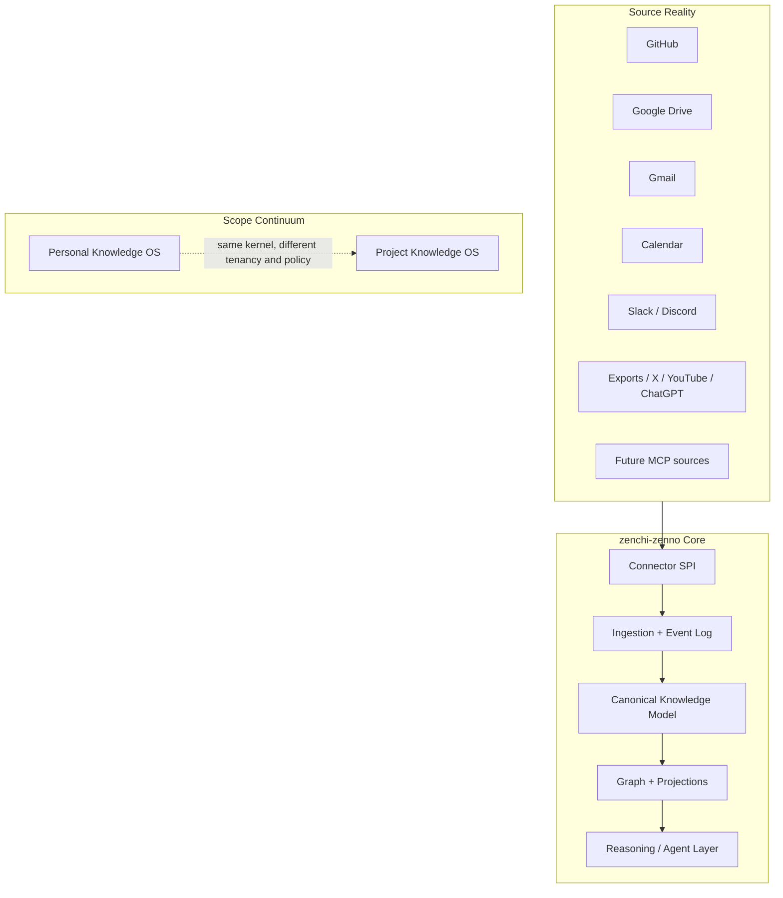
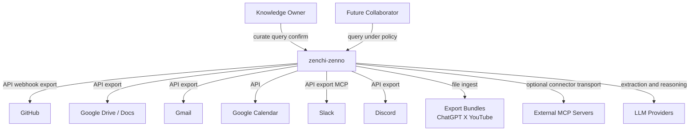
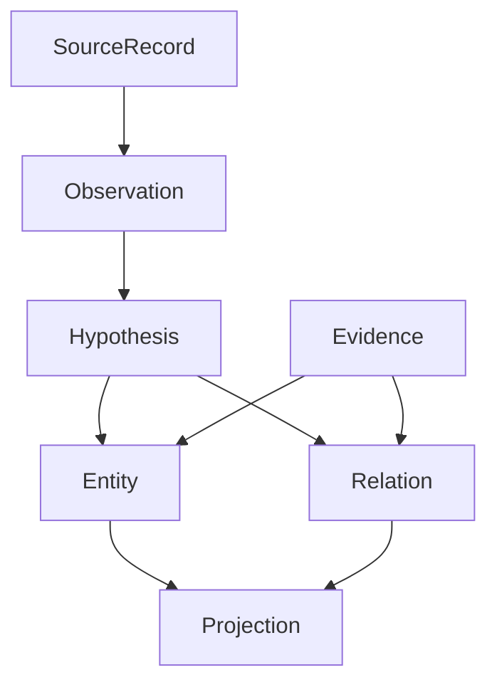
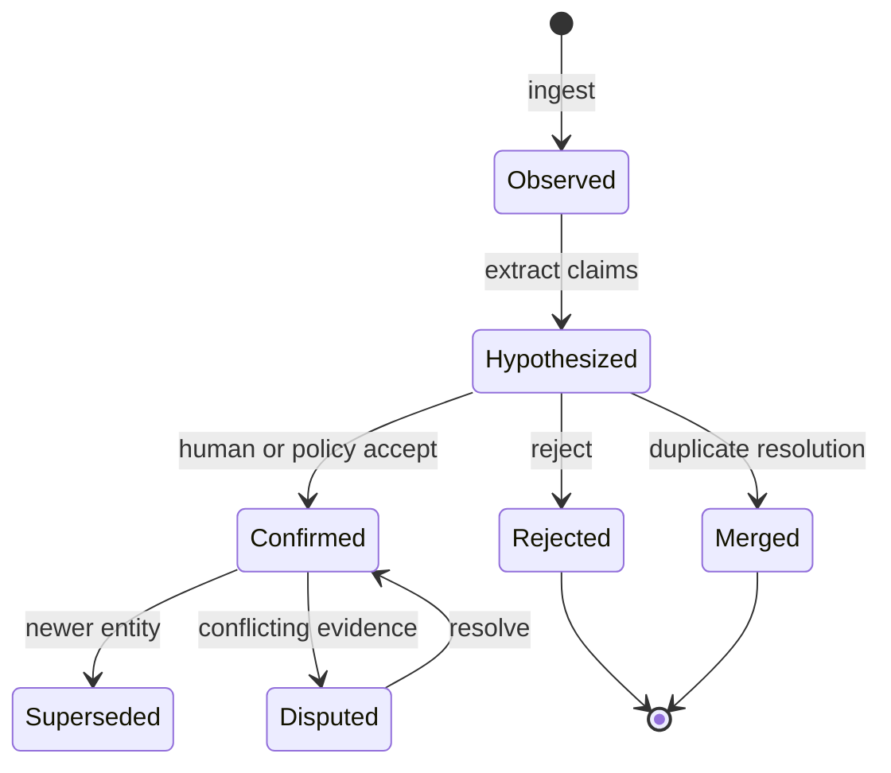
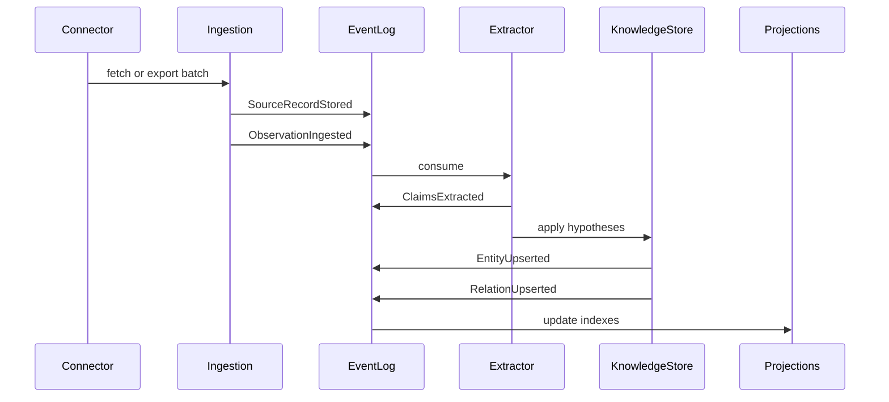
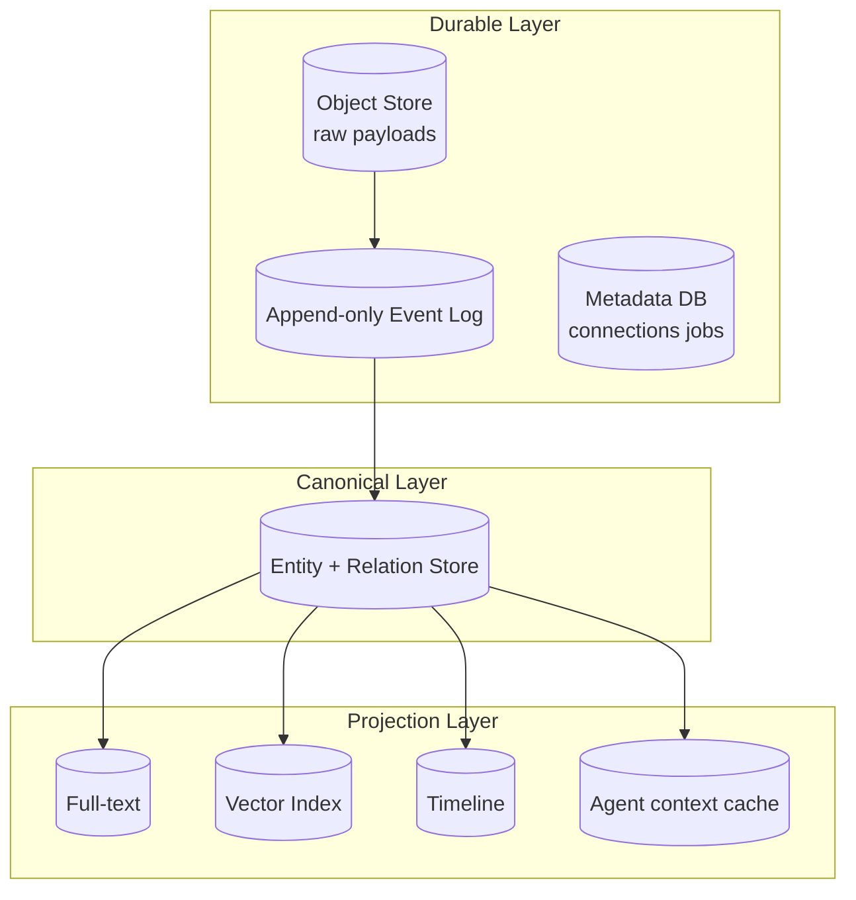
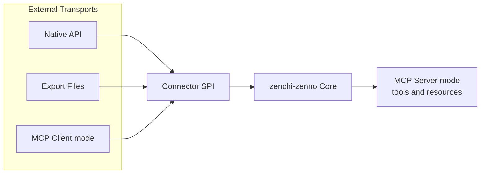
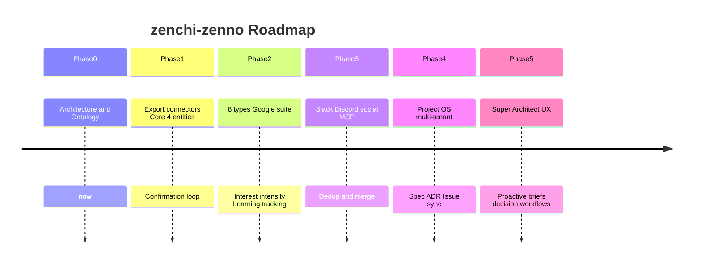
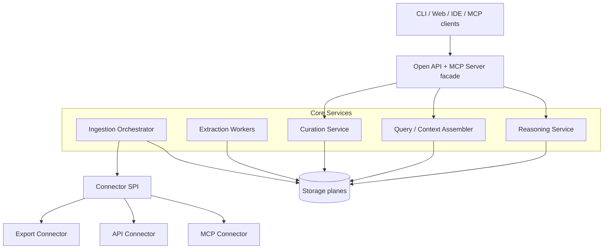

# zenchi-zenno Architecture

**Document status:** Draft v0.2 (Phase 1 — Personal MVP in progress)  
**Codename:** zenchi-zenno  
**Scope continuum:** Personal Knowledge OS → Project Knowledge OS  
**North star:** A source-agnostic knowledge operating system that behaves like a super-architect who has been present since day one.  
**Commercial boundary:** [commercial-boundary.md](commercial-boundary.md) · [license-strategy.md](license-strategy.md)

---

## Table of contents

1. [Product Vision](#1-product-vision)
2. [System Context](#2-system-context)
3. [Core Domain Design](#3-core-domain-design)
4. [Ubiquitous Language](#4-ubiquitous-language)
5. [Knowledge Model](#5-knowledge-model)
6. [Event Model](#6-event-model)
7. [Storage Design](#7-storage-design)
8. [MCP Integration Strategy](#8-mcp-integration-strategy)
9. [OSS Differentiation](#9-oss-differentiation)
10. [MVP Scope](#10-mvp-scope)
11. [Phased Roadmap](#11-phased-roadmap)

**Deep-dive specs:** [knowledge-model.md](knowledge-model.md) · [event-model.md](event-model.md) · [connector-spi.md](connector-spi.md) · [ubiquitous-language.md](ubiquitous-language.md) · [commercial-boundary.md](commercial-boundary.md)

---

## Design thesis

RAG is one retrieval mechanism, not the product center. zenchi-zenno is organized in three layers:

1. **Source Reality** — raw payloads and provenance (never discarded)
2. **Canonical Knowledge** — normalized `Decision`, `Idea`, `Project`, `Person`, `Interest`, `Learning`, `Artifact`, `Event` objects
3. **Cognitive Interface** — interpretation, reasoning, and dialogue as a long-tenured super-architect

API, Export, and MCP are all **adapters**. The domain model and storage contracts are the source of truth.



---

## 1. Product Vision

### Vision statement

> **zenchi-zenno continuously normalizes scattered activity signals into shared knowledge concepts, making personal (and later project) context, decisions, and learning reusable — as if a super-architect had been present from the beginning.**

### What it is / is not

| Is                                                   | Is not                                            |
| ---------------------------------------------------- | ------------------------------------------------- |
| Lifecycle management of normalized knowledge objects | A wrapper that dumps everything into a chat model |
| Event-sourced evolution of knowledge over time       | A single-vendor knowledge base                    |
| A kernel that scales from Personal to Project OS     | A replacement for collaboration tools themselves  |
| Connector-pluggable open infrastructure              | An MCP-only runtime                               |

### User outcomes

**Personal (now)**

- Trace _when_ and _from what evidence_ a decision was made
- Connect `Idea`, `Interest`, and `Learning` across heterogeneous sources
- See the structure of current interests from what you wrote, read, discussed, and watched

**Project (future)**

- Unify requirements, design docs, meeting notes, issues, Slack, and Git in one model
- Let newcomers and successor agents explain _why things are the way they are_ via Decision graphs
- Apply the same kernel under organizational policy with tenancy and ACL

### Design principles

1. **Canonical over Chatty** — first-class citizens are knowledge objects, not chat logs
2. **Provenance is sacred** — raw sources are retained; every claim links to evidence
3. **Adapter, not Assumption** — ingestion transport must not shape the domain
4. **Personal first, Project-ready** — tenancy, ACL, and review are designed in from the start
5. **Human confirmation loops** — extraction produces hypotheses; `Decision` and similar types require confirmation
6. **Projection diversity** — graph, full-text, vector, and timeline are all derived views

---

## 2. System Context



### Context boundaries

**Inside zenchi-zenno**

- Connector SPI, ingestion orchestration, event log
- Canonical knowledge graph, projection indexes
- Policy, workspace boundaries, agent APIs

**Outside zenchi-zenno**

- SaaS platforms, MCP server implementations, LLM vendors
- Client UIs (CLI, web, IDE, MCP clients — all consumers)

---

## 3. Core Domain Design

### Bounded contexts

```mermaid
flowchart LR
  subgraph ingestion [Ingestion Context]
    Conn[Connector]
    Norm[Source Normalizer]
    Dedup[Idempotency / Dedup]
  end

  subgraph knowledge [Knowledge Context]
    Ent[Entity Lifecycle]
    Rel[Relation Graph]
    Ext[Extraction Hypotheses]
    Cur[Curation / Confirmation]
  end

  subgraph temporal [Temporal / Event Context]
    EL[Append-only Event Log]
    TL[Timeline Projections]
  end

  subgraph cognition [Cognition Context]
    Q[Query Plans]
    R[Reasoning Episodes]
    Mem[Working Context Assembly]
  end

  subgraph policy [Identity and Policy Context]
    Ten[Tenancy]
    ACL[ACL / Sensitivity]
    Cons[Consent and Retention]
  end

  ingestion --> temporal
  temporal --> knowledge
  knowledge --> cognition
  policy -.-> ingestion
  policy -.-> knowledge
  policy -.-> cognition
```



### Aggregates

| Aggregate          | Responsibility                                             |
| ------------------ | ---------------------------------------------------------- |
| `SourceConnection` | Connector config, auth, sync cursor                        |
| `SourceRecord`     | Immutable snapshot reference to raw payload                |
| `Observation`      | Normalized "what was seen" at a point in time              |
| `KnowledgeEntity`  | Typed canonical object (`Decision`, `Idea`, …)             |
| `Relation`         | Typed semantic link between entities or evidence           |
| `CurationAction`   | Human or policy confirmation, rejection, merge             |
| `ReasoningEpisode` | Auditable record of what an agent referenced and concluded |

Personal and Project differ primarily in **Policy Context + tenancy**. Entity types are shared.

### Core invariant

> **Every Claim links to one or more Evidence records, carries a confidence score, and has a confirmation state.**

---

## 4. Ubiquitous Language

See the full glossary in [ubiquitous-language.md](ubiquitous-language.md).

### Critical distinctions (do not conflate)

| Term             | Meaning                                                         |
| ---------------- | --------------------------------------------------------------- |
| `Observation`    | A fact observed in a source (commit, email, message)            |
| `Entity`         | Canonical normalized knowledge (`Decision`, `Artifact`, …)      |
| `Domain Event`   | Internal append-only system fact (`ObservationIngested`, …)     |
| `Event` (entity) | User-facing occurrence (meeting, release, conversation session) |
| `Evidence`       | Link from a claim or entity back to an `Observation`            |
| `Hypothesis`     | Unconfirmed claim with confidence                               |
| `Confirmation`   | Action that accepts, rejects, or merges a hypothesis            |

---

## 5. Knowledge Model

This section is the architectural center. See [knowledge-model.md](knowledge-model.md) for exhaustive field-level detail.

### 5.1 Design intent

Source-specific schemas (`Commit`, `DriveFile`, `SlackMessage`) must not be the application center. They remain **Observation types**. Meaning lives in shared Entity types.



### 5.2 Entity type system

All entities share a common header:

| Field                       | Meaning                                                  |
| --------------------------- | -------------------------------------------------------- |
| `id`                        | ULID or UUID                                             |
| `workspace_id`              | Personal or Project boundary                             |
| `type`                      | One of eight canonical types                             |
| `title`                     | Human-readable short name                                |
| `summary`                   | One-paragraph current summary (may be cached projection) |
| `status`                    | Type-specific lifecycle state                            |
| `sensitivity`               | `private`, `shareable`, `restricted`, …                  |
| `confidence`                | 0–1 when extraction-derived                              |
| `confirmation_state`        | `hypothesized`, `confirmed`, `disputed`, `archived`      |
| `valid_from` / `valid_to`   | Valid time (when the knowledge held)                     |
| `created_at` / `updated_at` | System time                                              |
| `aliases`                   | Surface-form variants                                    |
| `tags`                      | Lightweight labels (distinct from `Interest`)            |
| `evidence_refs`             | References to Evidence                                   |
| `provenance`                | Extractor model, prompt version, connector version       |

#### The eight canonical types

| Type         | Role                                               | Typical status flow                                            |
| ------------ | -------------------------------------------------- | -------------------------------------------------------------- |
| **Decision** | Adopted conclusion with rationale and alternatives | `proposed` → `accepted` → `superseded` / `retracted`           |
| **Idea**     | Unadopted or exploring concept                     | `captured` → `exploring` → `promoted` / `parked` / `discarded` |
| **Project**  | Bounded initiative container                       | `active` → `paused` / `completed` / `abandoned`                |
| **Person**   | Human or stable agent identity                     | Identity resolution via hypothesis → confirmation              |
| **Interest** | Sustained topic or domain of attention             | `emerging` → `active` → `waning` / `archived`                  |
| **Learning** | Record of understanding gained                     | `noted` → `practiced` → `internalized`                         |
| **Artifact** | Durable output (doc, code, note, diagram)          | `draft` → `active` → `deprecated` / `deleted_at_source`        |
| **Event**    | Time-bound occurrence (meeting, release, session)  | `scheduled` → `occurred` / `cancelled`                         |

#### Decision (expanded)

A Decision is not a summary — it is an adopted choice.

- **Required semantics:** `rationale`, `alternatives[]`, `decided_at`, `impact_scope`, `decision_makers[]`
- **Typical evidence:** meeting notes, ADRs, issue comments, Slack threads, design doc diffs
- **Evolution:** superseded by a newer Decision via `supersedes` relation

#### Idea (expanded)

- May `promoted_to` a Decision
- Often clusters around an Interest or Project

#### Project (expanded)

- Personal scope is valid (e.g. "job search", "side project X")
- Bundles Artifacts, Decisions, Events via `belongs_to`

### 5.3 Relation model

Relations are typed and carry `confirmation_state` and `evidence_refs`.

| Predicate         | From → To                                        | Meaning                          |
| ----------------- | ------------------------------------------------ | -------------------------------- |
| `evidences`       | Evidence → Entity / Relation                     | Grounding link                   |
| `derived_from`    | Entity → Observation / Entity                    | Provenance                       |
| `about`           | Event / Artifact / Learning → Interest / Project | Subject matter                   |
| `produced`        | Person / Project → Artifact                      | Creation                         |
| `participated_in` | Person → Event                                   | Attendance or involvement        |
| `decides_for`     | Decision → Project / Artifact                    | Scope of applicability           |
| `supersedes`      | Decision → Decision                              | Replacement                      |
| `promoted_to`     | Idea → Decision                                  | Promotion                        |
| `related_to`      | * ↔ *                                            | Weak association (use sparingly) |
| `mentions`        | Observation → Person / Artifact                  | Low-confidence mention           |
| `learns`          | Person → Learning                                | Learning subject                 |
| `contradicts`     | Claim / Decision ↔ Claim / Decision              | Conflict                         |
| `belongs_to`      | * → Project / Workspace                          | Containment                      |

### 5.4 Observation model (pre-canonical)

```text
Observation {
  id, source_system, source_type, source_native_id,
  observed_at, ingested_at,
  actor?: PersonRefHypothesis,
  title?, text?, structured?,
  pointers: { url?, thread_id?, repo?, path?, message_id? },
  content_ref,   // SourceRecord
  checksum, localization, language?
}
```

### 5.5 Source → Observation → Entity mapping

| Source object     | Observation type  | Primary entity candidates                                      |
| ----------------- | ----------------- | -------------------------------------------------------------- |
| Git commit        | `code.change`     | Artifact, Event, Learning?, Decision? (if message is explicit) |
| PR + review       | `code.review`     | Decision, Artifact, Person                                     |
| Drive document    | `doc.revision`    | Artifact, Idea, Decision (via extraction)                      |
| Meeting notes     | `meeting.notes`   | Event, Decision, Person, Project                               |
| Slack thread      | `chat.thread`     | Event, Idea, Decision (candidate), Person                      |
| Calendar entry    | `calendar.event`  | Event, Person, Project                                         |
| Email             | `email.message`   | Event, Person, Idea / Decision (low recall)                    |
| ChatGPT export    | `ai.conversation` | Idea, Learning, Decision (candidate), Interest                 |
| YouTube history   | `media.view`      | Event, Interest, Learning                                      |
| X post / bookmark | `social.post`     | Interest, Idea, Person                                         |

### 5.6 Extraction rule (critical)

> **A single Slack message is not a Decision.**

Extraction creates `Hypothesis(Decision)` (or Idea). Promotion requires corroborating evidence, explicit decision language, or human Confirmation.

### 5.7 Confirmation state machine



Agent behavior:

- Prefer **Confirmed** entities in answers
- Label **Hypothesized** claims explicitly
- Never present hypothesis as fact

### 5.8 Entity-relationship overview

```mermaid
erDiagram
  WORKSPACE ||--o{ ENTITY : contains
  ENTITY ||--o{ ENTITY_VERSION : versions
  ENTITY ||--o{ RELATION : from
  ENTITY ||--o{ RELATION : to
  OBSERVATION ||--o{ EVIDENCE : supports
  EVIDENCE }o--|| ENTITY : evidences
  EVIDENCE }o--o| RELATION : evidences
  SOURCE_RECORD ||--o{ OBSERVATION : materializes
  ENTITY ||--o{ PROJECTION_REF : indexed_as
```

### 5.9 Personal → Project evolution

Same entity types. Additions for Project phase:

- `WorkspaceKind`: `personal` | `project`
- Shared policy, mandatory review for certain Decisions, PII redaction
- Optional subtypes: `Requirement`, `Risk`, `ADR` as Decision or Artifact specializations
- Multi-actor Confirmation (relax single-owner assumption)

---

## 6. Event Model

See [event-model.md](event-model.md) for the full catalog.

### Two event concepts (strict separation)

| Concept          | Layer                  | Example                                 |
| ---------------- | ---------------------- | --------------------------------------- |
| **Domain Event** | System append-only log | `ObservationIngested`                   |
| **Event entity** | Canonical knowledge    | "Sprint planning meeting on 2026-03-01" |

### Ingestion sequence



### Idempotency key

```
(workspace_id, source_system, source_native_id, content_checksum)
```

Re-ingestion must not duplicate entities. Re-extraction emits new `ClaimsExtracted` events with version metadata.

---

## 7. Storage Design



| Store        | Role                            | Implementation stance                                |
| ------------ | ------------------------------- | ---------------------------------------------------- |
| Object Store | Immutable `SourceRecord` bodies | S3-compatible or local filesystem                    |
| Event Log    | Domain events                   | Postgres append table, NATS, or file log — swappable |
| Metadata DB  | Connections, jobs, cursors      | OLTP                                                 |
| Entity Store | Current graph state             | Postgres + JSONB or property graph — TBD             |
| Full-text    | Lexical search                  | Postgres FTS or OpenSearch                           |
| Vector       | Similarity (non-canonical)      | pgvector, sqlite-vec, Qdrant — swappable             |
| Local-first  | Single-machine deployment       | All layers embeddable (OSS requirement)              |

### Storage principles

1. **Raw is immutable** — deletion is policy-driven tombstone, not silent erase
2. **Vector is not truth** — embeddings are projections
3. **Schema evolution via events** — versioned claims survive model changes
4. **Encryption and workspace isolation from day one**
5. **Exportability** — users can export canonical knowledge and provenance

### Personal → Project in storage

- `workspace_id` partitions all durable data
- Policy Context enforces ACL at query and ingestion boundaries
- Same physical stores; logical isolation via workspace + sensitivity

---

## 8. MCP Integration Strategy

MCP is a **first-class transport**, not a **first-class domain**.



### Two faces of MCP

**Ingress** — zenchi-zenno acts as MCP client inside a Connector implementation. Useful when no stable API exists.

**Egress** — zenchi-zenno exposes an MCP server with tools such as:

- `search_entities`
- `get_decision_trace`
- `list_evidence`
- `get_entity_graph`

### Connector SPI operations

| Operation                 | Purpose                                 |
| ------------------------- | --------------------------------------- |
| `discover()`              | List available source objects or scopes |
| `authenticate()`          | Establish credentials                   |
| `sync(cursor)`            | Incremental fetch → Observations        |
| `fetch(native_id)`        | Single SourceRecord                     |
| `map_to_observation(raw)` | Normalize to Observation                |
| `capabilities()`          | incremental?, webhook?, export-only?    |

See [connector-spi.md](connector-spi.md).

### Non-goals

- Runtime that requires MCP to function
- Host-specific persistence (Claude Desktop, Cursor, etc.)
- MCP tool names as domain vocabulary

---

## 9. OSS Differentiation

Compared to "second brain", note-sync, and RAG-memory tools:

1. **Canonical entity ontology as product center** — not a memo app or chat UI
2. **Decision archaeology** — trace chains of rationale across sources
3. **Hypothesis → Confirmation protocol** — extraction honesty by design
4. **Connector-agnostic SPI** — API, Export, MCP as peers
5. **Event-log-backed knowledge evolution** — time-aware, not embedding-point-only
6. **Personal → Project on one kernel** — tenancy designed in, not bolted on
7. **Local-first capable** — data sovereignty
8. **ReasoningEpisode audit** — what the agent saw and concluded
9. **Vendor-neutral** — LLM and vector stores are replaceable
10. **Super-architect as emergent behavior** — from model reuse, not persona prompting alone

---

## 10. MVP Scope

### Goal

> Ingest from 2+ source types, extract hypotheses for 4 entity types, link evidence, search, traverse, and confirm — with one agent skill for decision traceability.

### In scope

| Area                                   | Detail                                                                        |
| -------------------------------------- | ----------------------------------------------------------------------------- |
| Sources                                | ChatGPT export, GitHub (export or read-only API), local Markdown              |
| Entity types                           | Decision, Idea, Artifact, Event                                               |
| Interest / Learning / Person / Project | Minimal or manual creation                                                    |
| Core                                   | Evidence links required, Confirmation CLI, full-text + simple graph traversal |
| Agent skill                            | "What did I decide about X, and what is the evidence?"                        |

### Out of scope

- Slack / Gmail / Drive live sync
- Multi-tenant ACL
- Auto-confirmed Decisions
- Mobile client
- Cloud vendor lock-in

### Success metrics

- Same decision linkable across multiple source evidences
- Re-ingestion does not explode entity count (idempotent)
- Hypothesis vs Confirmed visible in API/CLI
- Raw data retained and exportable

---

## 11. Phased Roadmap



### Phase gates

| Transition  | Gate                                                                                 |
| ----------- | ------------------------------------------------------------------------------------ |
| Phase 1 → 2 | Confirmation UX is low-friction; extraction precision acceptable or clearly labeled  |
| Phase 3 → 4 | Policy Context proven — sensitivity and workspace boundaries hold under real load    |
| Phase 4 → 5 | Decision graphs explain architectural history at human-architect quality on eval set |

---

## Appendix A — Logical component diagram



## Appendix B — Super-architect behavior (measurable)

An agent approaches the north star when it:

1. **Traceability** — every assertion links to Entity/Evidence
2. **Temporality** — distinguishes "then" from "now" (valid time)
3. **Confirmed-first** — does not state hypotheses as facts
4. **Decision awareness** — follows `supersedes` chains
5. **Gap confession** — states insufficient evidence explicitly

This is a product of Knowledge Model + Query Assembler + ReasoningEpisode — not prompt engineering alone.

## Appendix C — Schema stubs

Draft JSON Schema stubs live in [`schemas/`](../schemas/). They are **not** validated or code-generated in Phase 0.

| Schema       | Path                               |
| ------------ | ---------------------------------- |
| Entity base  | `schemas/entity.base.schema.json`  |
| Observation  | `schemas/observation.schema.json`  |
| Domain event | `schemas/domain-event.schema.json` |
