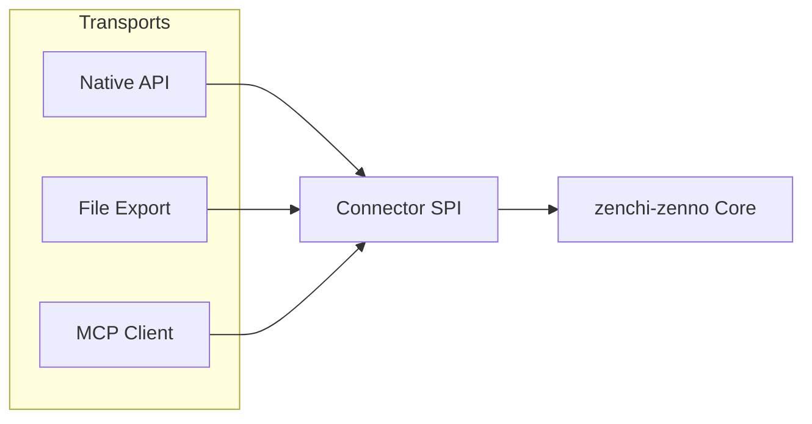
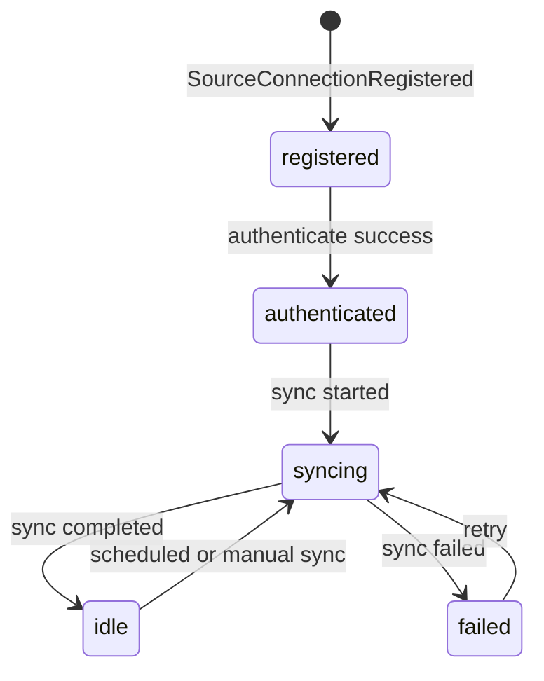
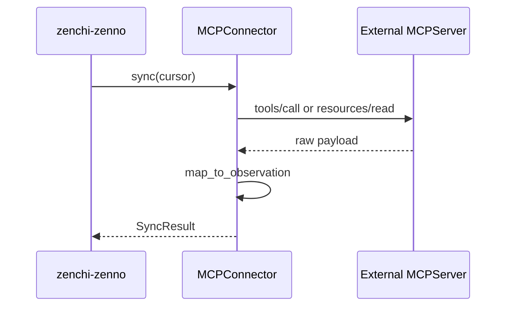

> **日本語版**（正本は英語: [connector-spi.md](connector-spi.ja.md)）。解釈が異なる場合は英語版を優先します。
>
> [English](connector-spi.ja.md) | 日本語

<a id="connector-spi"></a>

# Connector SPI

異種ソースから知識を取り込むためのサービス プロバイダー インターフェイス。

**関連:** [ARCHITECTURE.md](ARCHITECTURE.ja.md#8-mcp-integration-strategy) · [event-model.md](event-model.ja.md) · [connectors/README.md](../connectors/README.ja.md)

---

<a id="design-stance"></a>

## デザインのスタンス

コネクタは **アダプター** です。 SPI はトランスポートに依存しません。

| 輸送       | 例                                                           |
| ---------- | ------------------------------------------------------------ |
| **API**    | GitHub REST/GraphQL、Google API、Slack ウェブ API            |
| **Export** | ChatGPT JSON エクスポート、テイクアウト、アーカイブ バンドル |
| **MCP**    | 外部 MCP サーバーのリソースとツール                          |

MCP は、API および Export と同じ SPI を実装します。ドメインがトランスポート タイプに基づいて分岐することはありません。



---

<a id="connector-interface"></a>

## Connector インターフェース

概念的な契約 (言語に依存しない):

```text
interface Connector {
  metadata(): ConnectorMetadata
  authenticate(credentials): AuthResult
  capabilities(): Capabilities
  discover(scope?): DiscoverResult
  sync(cursor): SyncResult
  fetch(native_id): SourceRecord
  map_to_observation(record): Observation
  health(): HealthStatus
}
```

<a id="connectormetadata"></a>

### `ConnectorMetadata`

| フィールド             | 説明                                                    |
| ---------------------- | ------------------------------------------------------- |
| `id`                   | 安定したコネクタ識別子 (例: `github`、`chatgpt-export`) |
| `version`              | Connector 実装バージョン                                |
| `source_system`        | Observations                                            | に保存されている正規のソース名 |
| `supported_transports` | `api`、`export`、`mcp`                                  |

<a id="capabilities"></a>

### `Capabilities`

| 旗                  | 説明                                        |
| ------------------- | ------------------------------------------- |
| `incremental`       | カーソルベースの増分同期をサポート          |
| `webhook`           | プッシュ通知を受信できる                    |
| `export_only`       | ライブ API はありません。ファイルベースのみ |
| `realtime`          | 1分未満の遅延が可能                         |
| `observation_types` | 生成された `source_type` 値のリスト         |

<a id="syncresult"></a>

### `SyncResult`

| フィールド     | 説明                             |
| -------------- | -------------------------------- |
| `observations` | 正規化された観測のバッチ         |
| `cursor`       | 次の同期のための不透明なカーソル |
| `has_more`     | ページネーションフラグ           |
| `errors`       | 致命的ではない項目ごとのエラー   |

### `SyncInput`（実装）

| フィールド     | 説明                                                                 |
| -------------- | -------------------------------------------------------------------- |
| `path`         | ローカルエクスポート / fixture パス                                  |
| `workspace_id` | 対象ワークスペース                                                   |
| `token`        | 任意の API 認証情報（例: GitHub PAT）。ログや Observation に出さない |
| `repo`         | 任意の API スコープ（例: `owner/name`）                              |
| `limit`        | API の recent-N 取得上限                                             |

---

<a id="lifecycle"></a>

## ライフサイクル



---

<a id="idempotency-contract"></a>

## 冪等性契約

コネクタによって生成されるすべての Observation には、以下が含まれている必要があります。

| フィールド         | 目的                             |
| ------------------ | -------------------------------- |
| `source_system`    | メタデータから                   |
| `source_native_id` | ソース内の安定した ID            |
| `content_checksum` | 正規化されたコンテンツのハッシュ |

取り込みレイヤーは以下で重複排除を行います。

```
(workspace_id, source_system, source_native_id, content_checksum)
```

コネクタは、同期間で同じソース オブジェクトに対して新しい `source_native_id` 値を生成してはなりません。

---

<a id="maptoobservation-guidelines"></a>

## `map_to_observation` ガイドライン

1. **ポインタを保持** — URL、スレッド ID、repo/path、メッセージ ID
2. **エンティティを抽出しない** — コネクタは観測値のみを生成します。抽出は別の段階です
3. **タイムスタンプを正規化** — ソースからの `observed_at`。システムからの `ingested_at`
4. **仮説としてのアクター** — Person 参照は未解決のヒントであり、確認されていない Person エンティティ
5. **言語とロケール** — 利用可能な場合は通過します

---

<a id="mcp-as-ingress-transport"></a>

## MCP 入力トランスポートとして

`supported_transports` に `mcp` が含まれる場合:

- Connector は内部で MCP `tools` または `resources` を呼び出します
- MCP 応答は `SourceRecord` にマッピングされ、次に `Observation` にマッピングされます。
- MCP サーバーの利用不能は、ドメイン エラーとしてではなく、`SyncFailed` として表示されます
- Observation または Entity スキーマには MCP 固有のフィールドはありません

<a id="example-mcp-ingress-flow"></a>

### MCP 入力フローの例



---

<a id="mcp-egress-zenchi-zenno-as-server"></a>

## MCP 出力 (サーバーとして zenchi-zenno)

Phase 1 では薄いローカル MCP サーバー（`@zenchi-zenno/mcp-server`、`zz mcp`）を同梱します:

| ツール               | 説明                                                     |
| -------------------- | -------------------------------------------------------- |
| `search_entities`    | 正規エンティティに対するフルテキスト検索とフィルター検索 |
| `get_decision_trace` | Decision グラフを Evidence と `derived_from` 付きで辿る  |
| `list_evidence`      | エンティティの Evidence と Observation                   |
| `list_hypotheses`    | 確認待ちの Decision/Idea 仮説                            |

後日予定: `get_entity`、`get_entity_graph`。

Egress MCP ツールは、生のコネクタ内部ではなく、**正規の知識**に基づいて動作します。

---

<a id="error-handling"></a>

## エラー処理

| エラークラス       | 行動                                                                   |
| ------------------ | ---------------------------------------------------------------------- |
| 認証失敗           | `SyncFailed`、接続は `auth_error` とマークされています                 |
| レート制限         | バックオフを使用して再試行します。部分的な `SyncResult` は許可されます |
| アイテム解析エラー | `errors[]` にログインし、バッチを続行します。                          |
| 完全な失敗         | `SyncFailed`、カーソルが進んでいません                                 |

---

<a id="connector-registration"></a>

## Connector 登録

将来の `connectors/` パッケージはメタデータによって自己記述されます。フェーズ 0 では契約のみを定義します。

計画されたコネクタ: [connectors/README.md](../connectors/README.ja.md) を参照してください。

---

<a id="non-goals"></a>

## 非目標

- エンティティ ストアに直接書き込むコネクタ (イベント ログをバイパス)
- ドメイン モデル内の Connector 固有のエンティティ タイプ
- コネクタに必要な MCP ランタイム
- コネクタ内部の埋め込み生成（プロジェクション層に属する）

---

<a id="testing-expectations-phase-1"></a>

## 期待をテストする (フェーズ 1+)

各コネクタは以下を提供する必要があります。

- エクスポートモード用のフィクスチャファイル
- API モードの API 応答 (VCR スタイル) を記録しました
- マッピング テーブル: ソース オブジェクト → Observation フィールド
- 冪等性テスト: 同じ入力を 2 回 → 1 回 Observation
