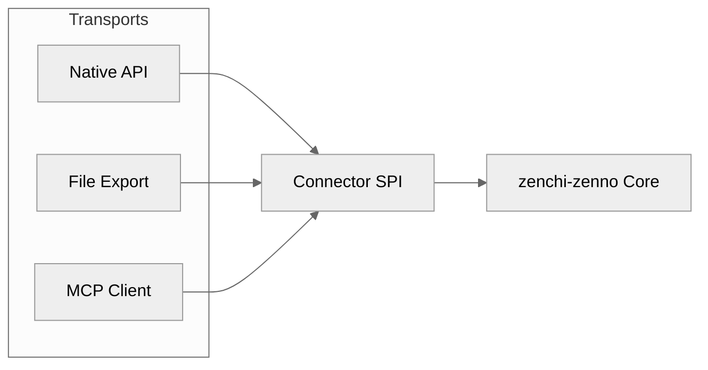
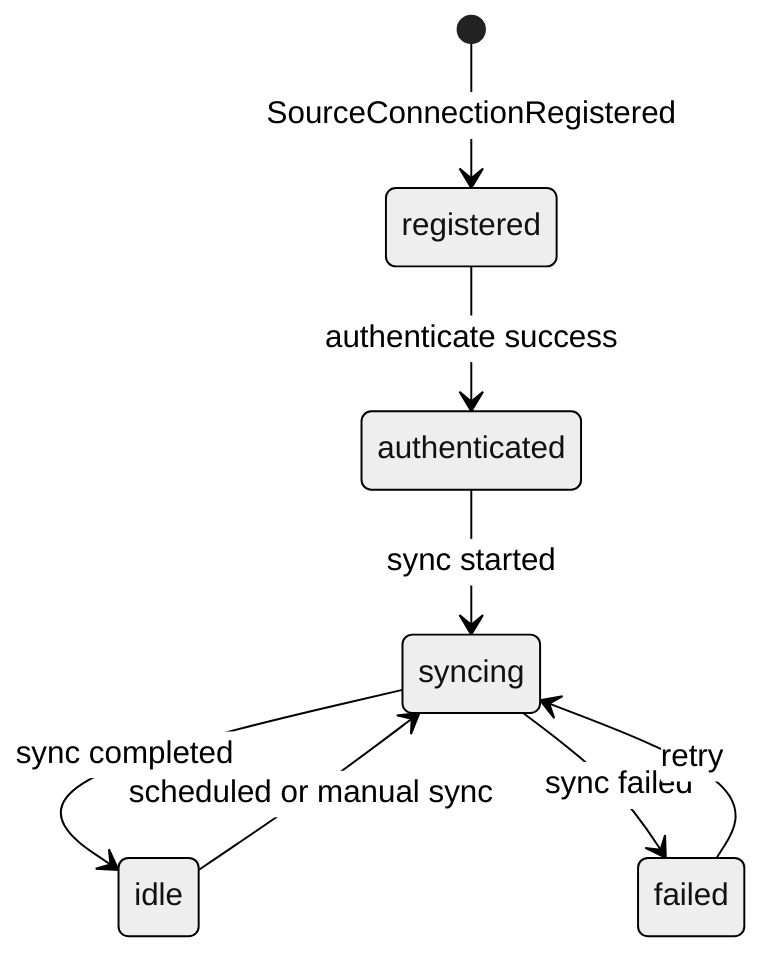
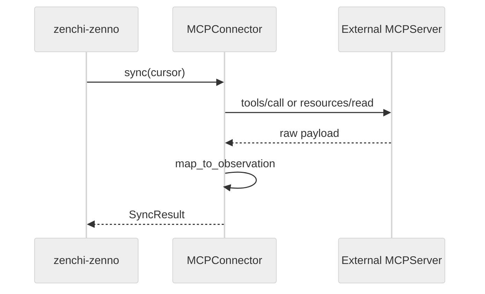

# Connector SPI

English | [日本語](connector-spi.ja.md)

Service Provider Interface for ingesting knowledge from heterogeneous sources.

**Related:** [ARCHITECTURE.md](ARCHITECTURE.md#8-mcp-integration-strategy) · [event-model.md](event-model.md) · [connectors/README.md](../connectors/README.md)

---

## Design stance

Connectors are **adapters**. The SPI is transport-agnostic:

| Transport  | Examples                                        |
| ---------- | ----------------------------------------------- |
| **API**    | GitHub REST/GraphQL, Google APIs, Slack Web API |
| **Export** | ChatGPT JSON export, Takeout, archive bundles   |
| **MCP**    | External MCP server resources and tools         |

MCP implements the same SPI as API and Export. The domain never branches on transport type.



---

## Connector interface

Conceptual contract (language-agnostic):

```text
interface Connector {
  metadata(): ConnectorMetadata
  authenticate(credentials): AuthResult
  capabilities(): Capabilities
  discover(scope?): DiscoverResult
  sync(cursor): SyncResult
  fetch(native_id): SourceRecord
  map_to_observation(record): Observation
  health(): HealthStatus
}
```

### `ConnectorMetadata`

| Field                  | Description                                                   |
| ---------------------- | ------------------------------------------------------------- |
| `id`                   | Stable connector identifier (e.g. `github`, `chatgpt-export`) |
| `version`              | Connector implementation version                              |
| `source_system`        | Canonical source name stored on Observations                  |
| `supported_transports` | `api`, `export`, `mcp`                                        |

### `Capabilities`

| Flag                | Description                            |
| ------------------- | -------------------------------------- |
| `incremental`       | Supports cursor-based incremental sync |
| `webhook`           | Can receive push notifications         |
| `export_only`       | No live API; file-based only           |
| `realtime`          | Sub-minute latency possible            |
| `observation_types` | List of `source_type` values produced  |

### `SyncResult`

| Field          | Description                      |
| -------------- | -------------------------------- |
| `observations` | Batch of normalized Observations |
| `cursor`       | Opaque cursor for next sync      |
| `has_more`     | Pagination flag                  |
| `errors`       | Non-fatal per-item errors        |

### `SyncInput` (implementation)

| Field          | Description                                                                 |
| -------------- | --------------------------------------------------------------------------- |
| `path`         | Local export / fixture path                                                 |
| `workspace_id` | Target workspace                                                            |
| `token`        | Optional API credential (e.g. GitHub PAT). Never log or put in Observations |
| `repo`         | Optional API scope such as `owner/name`                                     |
| `limit`        | Optional page size for recent-N API fetches                                 |

---

## Lifecycle



---

## Idempotency contract

Every Observation produced by a connector must include:

| Field              | Purpose                    |
| ------------------ | -------------------------- |
| `source_system`    | From metadata              |
| `source_native_id` | Stable ID in source        |
| `content_checksum` | Hash of normalized content |

The ingestion layer deduplicates on:

```
(workspace_id, source_system, source_native_id, content_checksum)
```

Connectors must not generate new `source_native_id` values for the same source object across syncs.

---

## `map_to_observation` guidelines

1. **Preserve pointers** — URLs, thread IDs, repo/path, message IDs
2. **Do not extract entities** — Connectors produce Observations only; extraction is a separate stage
3. **Normalize timestamps** — `observed_at` from source; `ingested_at` from system
4. **Actor as hypothesis** — Person references are unresolved hints, not confirmed Person entities
5. **Language and locale** — Pass through when available

---

## MCP as ingress transport

When `supported_transports` includes `mcp`:

- Connector internally calls MCP `tools` or `resources`
- MCP responses are mapped to `SourceRecord` then `Observation`
- MCP server unavailability surfaces as `SyncFailed` — not as domain errors
- No MCP-specific fields in Observation or Entity schemas

### Example MCP ingress flow



---

## MCP egress (zenchi-zenno as server)

Phase 1 ships a thin local MCP server (`@zenchi-zenno/mcp-server`, `zz mcp`) with:

| Tool                 | Description                                          |
| -------------------- | ---------------------------------------------------- |
| `search_entities`    | Full-text and filter search over canonical entities  |
| `get_decision_trace` | Walk Decision graph with evidence and `derived_from` |
| `list_evidence`      | Evidence and Observations for an entity              |
| `list_hypotheses`    | Hypothesized entities awaiting confirmation          |

Planned later: `get_entity`, `get_entity_graph`.

Egress MCP tools operate on **canonical knowledge**, not raw connector internals.

---

## Error handling

| Error class      | Behavior                                         |
| ---------------- | ------------------------------------------------ |
| Auth failure     | `SyncFailed`, connection marked `auth_error`     |
| Rate limit       | Retry with backoff, partial `SyncResult` allowed |
| Item parse error | Log in `errors[]`, continue batch                |
| Total failure    | `SyncFailed`, cursor not advanced                |

---

## Connector registration

Future `connectors/` packages self-describe via metadata. Phase 0 defines the contract only.

Planned connectors: see [connectors/README.md](../connectors/README.md).

---

## Non-goals

- Connectors that write directly to entity store (bypass event log)
- Connector-specific entity types in the domain model
- Required MCP runtime for any connector
- Embedding generation inside connectors (belongs in projection layer)

---

## Testing expectations (Phase 1+)

Each connector should provide:

- Fixture files for export mode
- Recorded API responses (VCR-style) for API mode
- Mapping table: source object → Observation fields
- Idempotency test: same input twice → one Observation
