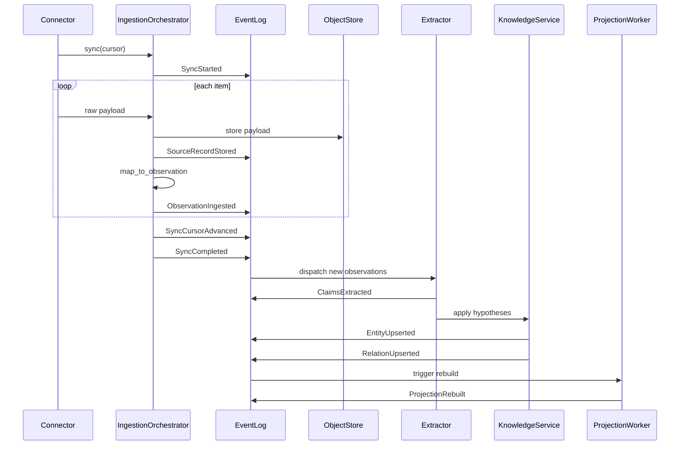

> **日本語版**（正本は英語: [event-model.md](event-model.ja.md)）。解釈が異なる場合は英語版を優先します。
>
> [English](event-model.ja.md) | 日本語

<a id="event-model"></a>

# Event モデル

zenchi-zenno の追加専用ドメイン イベント ログと取り込みライフサイクルの仕様。

**関連:** [ARCHITECTURE.md](ARCHITECTURE.ja.md#6-event-model) · [knowledge-model.md](knowledge-model.ja.md) · [schemas/domain-event.schema.json](../schemas/domain-event.schema.json)

---

<a id="principles"></a>

## 原則

1. **追加のみ** — ドメイン イベントは変更または削除されません (ポリシーの廃棄は除きます)。
2. **再生可能** — 現在の正規の状態をイベント + スナップショットから再構築できます
3. **冪等な取り込み** — ソース資料が重複しても知識は重複しません
4. **分離** — ドメイン イベント (システム) ≠ Event エンティティ (知識)

---

<a id="event-envelope"></a>

## Event 封筒

すべてのドメイン イベントは共通のエンベロープを共有します。

```text
DomainEvent {
  id,                    // ULID
  workspace_id,
  type,                  // e.g. ObservationIngested
  occurred_at,           // system time
  correlation_id?,       // batch or sync run
  causation_id?,         // prior event that caused this
  actor?,                // user, system, connector id
  payload,               // type-specific
  schema_version         // for evolution
}
```

---

<a id="event-catalog"></a>

## Event カタログ

<a id="connection-and-sync"></a>

### 接続と同期

| Event                        | ペイロードのハイライト                               | 発行者                     |
| ---------------------------- | ---------------------------------------------------- | -------------------------- |
| `SourceConnectionRegistered` | `connection_id`、`source_system`、`transport`        | 管理者/セットアップ        |
| `SourceConnectionUpdated`    | `connection_id`、フィールドが変更されました          | 管理者/セットアップ        |
| `SyncStarted`                | `connection_id`、`cursor_before`                     | 取り込みオーケストレーター |
| `SyncCompleted`              | `connection_id`、`cursor_after`、`observation_count` | 取り込みオーケストレーター |
| `SyncFailed`                 | `connection_id`、`error`、`cursor`                   | 取り込みオーケストレーター |
| `SyncCursorAdvanced`         | `connection_id`、`cursor`                            | Connector                  |

<a id="raw-storage-and-observation"></a>

### 生の保存と観察

| Event                   | ペイロードのハイライト                                          | 発行者             |
| ----------------------- | --------------------------------------------------------------- | ------------------ |
| `SourceRecordStored`    | `record_id`、`content_ref`、`checksum`、`source_native_id`      | 取り込み           |
| `ObservationIngested`   | `observation_id`、`source_type`、`source_native_id`、`checksum` | 取り込み           |
| `ObservationSuperseded` | `observation_id`、`superseded_by`                               | 取り込み（改訂版） |

<a id="extraction-and-knowledge-mutation"></a>

### 抽出と知識の突然変異

| Event              | ペイロードのハイライト                                    | 発行者              |
| ------------------ | --------------------------------------------------------- | ------------------- |
| `ClaimsExtracted`  | `observation_ids[]`、`claim_count`、`extractor_version`   | 抽出器              |
| `EntityUpserted`   | `entity_id`、`type`、`confirmation_state`、`diff_summary` | ナレッジサービス    |
| `RelationUpserted` | `relation_id`、`predicate`、`from_id`、`to_id`            | ナレッジサービス    |
| `EntityArchived`   | `entity_id`、`reason`                                     | キュレーション      |
| `EntitySuperseded` | `entity_id`、`superseded_by`                              | キュレーション/抽出 |

<a id="curation-and-confirmation"></a>

### キュレーションと確認

| Event                 | ペイロードのハイライト                                    | 発行者                 |
| --------------------- | --------------------------------------------------------- | ---------------------- |
| `HypothesisConfirmed` | `entity_id` または `relation_id`、`confirmed_by`          | キュレーション         |
| `HypothesisRejected`  | `entity_id` または `relation_id`、`rejected_by`、`reason` | キュレーション         |
| `EntitiesMerged`      | `survivor_id`、`merged_ids[]`、`merged_by`                | キュレーション         |
| `DisputeRaised`       | `entity_ids[]`、`reason`                                  | システムまたはユーザー |
| `DisputeResolved`     | `resolution`、`resolved_by`                               | キュレーション         |

<a id="projections-and-cognition"></a>

### プロジェクションと認知

| Event                      | ペイロードのハイライト                                    | 発行者              |
| -------------------------- | --------------------------------------------------------- | ------------------- |
| `ProjectionRebuilt`        | `projection_type`、`entity_count`、`duration_ms`          | Projection ワーカー |
| `ProjectionStale`          | `projection_type`、`reason`                               | モニター            |
| `ReasoningEpisodeRecorded` | `episode_id`、`entity_refs[]`、`evidence_refs[]`、`query` | 推論サービス        |

---

<a id="ingestion-sequence"></a>

## 取り込みシーケンス



---

<a id="idempotency"></a>

## べき等性

<a id="ingestion-dedup-key"></a>

### インジェスト重複排除キー

```
(workspace_id, source_system, source_native_id, content_checksum)
```

同じキーが再度表示された場合:

- 重複しない `ObservationIngested` を出力します (または `duplicate: true` フラグを使用して出力します — 実装の選択)
- 重複したエンティティを作成しないでください

<a id="re-extraction"></a>

### 再抽出

エクストラクターのバージョンが変更された場合は、既存の観測を再処理します。

- 新しい `ClaimsExtracted` を `extractor_version` で出力します
- `provenance` が更新されたエンティティの更新/挿入
- 明示的な `HypothesisRejected` または `EntitiesMerged` を指定せずに、以前の仮説を削除しないでください。

---

<a id="replay-semantics"></a>

## 再生セマンティクス

<a id="full-replay"></a>

### フルリプレイ

1. すべてのドメイン イベントを `occurred_at` の順序で読み取ります
2. イベント ハンドラーを適用してエンティティ ストアとリレーション グラフを再構築する
3. すべてのプロジェクションを正規の状態から再構築します

<a id="snapshot-replay"></a>

### スナップショット + リプレイ

パフォーマンスのために、正規状態の定期的なスナップショットが許可されています。

```
snapshot_at_event_id + events_since_snapshot → current state
```

スナップショットは最適化です。イベント ログは依然として監査の信頼できる情報源です。

---

<a id="correlation-and-causation"></a>

## 相関関係と因果関係

| フィールド       | 使用                                                                   |
| ---------------- | ---------------------------------------------------------------------- |
| `correlation_id` | すべてのイベントを 1 回の同期実行またはユーザー アクションに結び付ける |
| `causation_id`   | これを直接引き起こしたイベントを指定してください                       |

チェーンの例:

```
ObservationIngested → ClaimsExtracted → EntityUpserted → HypothesisConfirmed
         ↑___________________causation chain___________________|
```

---

<a id="domain-event-vs-event-entity"></a>

## Domain Event 対 Event エンティティ

|              | Domain Event            | Event エンティティ               |
| ------------ | ----------------------- | -------------------------------- |
| レイヤー     | システムログ            | ナレッジグラフ                   |
| 例           | `ObservationIngested`   | 「スプリント計画 2026-07-15」    |
| 作成者       | インジェスト / サービス | 抽出 + Confirmation              |
| クエリの使用 | 監査、再生、デバッグ    | ユーザーからの質問、タイムライン |

---

<a id="event-schema-evolution"></a>

## Event スキーマの進化

- すべてのイベントには `schema_version` が含まれます
- ハンドラーは未知のフィールドを許容する必要があります (上位互換性)
- ペイロードの重大な変更には、新しいイベント タイプまたは移行メモ付きのバージョン バンプが必要です
- [オントロジー変更問題テンプレート](../.github/ISSUE_TEMPLATE/ontology-change.md) 経由でオントロジー変更を追跡

---

<a id="retention-and-policy"></a>

## 保持とポリシー

- ドメイン イベントはワークスペース保持ポリシーに従います
- 廃棄イベント (`SourceRecordPurged`、`ObservationPurged`) は、パージ自体の監査履歴を消去せずに、ポリシーに基づく削除を記録します。
- 個人ワークスペースはデフォルトで所有者のみのアクセスに設定されています。 Project ワークスペースは、ポリシー コンテキストに ACL を追加します
