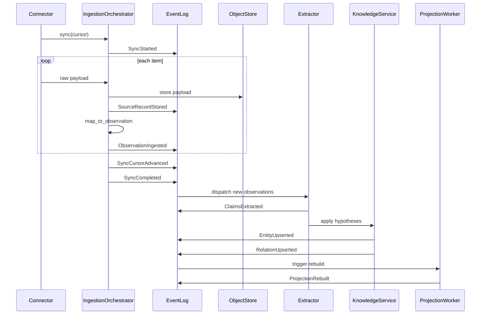

# Event Model

Specification for zenchi-zenno's append-only domain event log and ingestion lifecycle.

**Related:** [ARCHITECTURE.md](ARCHITECTURE.md#6-event-model) · [knowledge-model.md](knowledge-model.md) · [schemas/domain-event.schema.json](../schemas/domain-event.schema.json)

---

## Principles

1. **Append-only** — domain events are never mutated or deleted (policy tombstones excepted)
2. **Replayable** — current canonical state can be reconstructed from events + snapshots
3. **Idempotent ingestion** — duplicate source material does not duplicate knowledge
4. **Separation** — Domain Events (system) ≠ Event entities (knowledge)

---

## Event envelope

All domain events share a common envelope:

```text
DomainEvent {
  id,                    // ULID
  workspace_id,
  type,                  // e.g. ObservationIngested
  occurred_at,           // system time
  correlation_id?,       // batch or sync run
  causation_id?,         // prior event that caused this
  actor?,                // user, system, connector id
  payload,               // type-specific
  schema_version         // for evolution
}
```

---

## Event catalog

### Connection and sync

| Event | Payload highlights | Emitted by |
|-------|-------------------|------------|
| `SourceConnectionRegistered` | `connection_id`, `source_system`, `transport` | Admin / setup |
| `SourceConnectionUpdated` | `connection_id`, changed fields | Admin / setup |
| `SyncStarted` | `connection_id`, `cursor_before` | Ingestion orchestrator |
| `SyncCompleted` | `connection_id`, `cursor_after`, `observation_count` | Ingestion orchestrator |
| `SyncFailed` | `connection_id`, `error`, `cursor` | Ingestion orchestrator |
| `SyncCursorAdvanced` | `connection_id`, `cursor` | Connector |

### Raw storage and observation

| Event | Payload highlights | Emitted by |
|-------|-------------------|------------|
| `SourceRecordStored` | `record_id`, `content_ref`, `checksum`, `source_native_id` | Ingestion |
| `ObservationIngested` | `observation_id`, `source_type`, `source_native_id`, `checksum` | Ingestion |
| `ObservationSuperseded` | `observation_id`, `superseded_by` | Ingestion (revision) |

### Extraction and knowledge mutation

| Event | Payload highlights | Emitted by |
|-------|-------------------|------------|
| `ClaimsExtracted` | `observation_ids[]`, `claim_count`, `extractor_version` | Extractor |
| `EntityUpserted` | `entity_id`, `type`, `confirmation_state`, `diff_summary` | Knowledge service |
| `RelationUpserted` | `relation_id`, `predicate`, `from_id`, `to_id` | Knowledge service |
| `EntityArchived` | `entity_id`, `reason` | Curation |
| `EntitySuperseded` | `entity_id`, `superseded_by` | Curation / extraction |

### Curation and confirmation

| Event | Payload highlights | Emitted by |
|-------|-------------------|------------|
| `HypothesisConfirmed` | `entity_id` or `relation_id`, `confirmed_by` | Curation |
| `HypothesisRejected` | `entity_id` or `relation_id`, `rejected_by`, `reason` | Curation |
| `EntitiesMerged` | `survivor_id`, `merged_ids[]`, `merged_by` | Curation |
| `DisputeRaised` | `entity_ids[]`, `reason` | System or user |
| `DisputeResolved` | `resolution`, `resolved_by` | Curation |

### Projections and cognition

| Event | Payload highlights | Emitted by |
|-------|-------------------|------------|
| `ProjectionRebuilt` | `projection_type`, `entity_count`, `duration_ms` | Projection worker |
| `ProjectionStale` | `projection_type`, `reason` | Monitor |
| `ReasoningEpisodeRecorded` | `episode_id`, `entity_refs[]`, `evidence_refs[]`, `query` | Reasoning service |

---

## Ingestion sequence



---

## Idempotency

### Ingestion dedup key

```
(workspace_id, source_system, source_native_id, content_checksum)
```

If the same key is seen again:

- Emit no duplicate `ObservationIngested` (or emit with `duplicate: true` flag — implementation choice)
- Do not create duplicate entities

### Re-extraction

When an extractor version changes, re-process existing Observations:

- Emit new `ClaimsExtracted` with `extractor_version`
- Upsert entities with updated `provenance`
- Do not delete prior hypotheses without explicit `HypothesisRejected` or `EntitiesMerged`

---

## Replay semantics

### Full replay

1. Read all domain events in `occurred_at` order
2. Apply event handlers to rebuild entity store and relation graph
3. Rebuild all projections from canonical state

### Snapshot + replay

For performance, periodic snapshots of canonical state are allowed:

```
snapshot_at_event_id + events_since_snapshot → current state
```

Snapshots are an optimization. The event log remains the audit source of truth.

---

## Correlation and causation

| Field | Use |
|-------|-----|
| `correlation_id` | Tie all events in one sync run or user action |
| `causation_id` | Point to the event that directly caused this one |

Example chain:

```
ObservationIngested → ClaimsExtracted → EntityUpserted → HypothesisConfirmed
         ↑___________________causation chain___________________|
```

---

## Domain Event vs Event entity

| | Domain Event | Event entity |
|---|--------------|--------------|
| Layer | System log | Knowledge graph |
| Example | `ObservationIngested` | "Sprint planning 2026-07-15" |
| Created by | Ingestion / services | Extraction + Confirmation |
| Query use | Audit, replay, debug | User questions, timelines |

---

## Event schema evolution

- Every event carries `schema_version`
- Handlers must tolerate unknown fields (forward compatibility)
- Breaking payload changes require new event type or version bump with migration notes
- Ontology changes tracked via [ontology-change issue template](../.github/ISSUE_TEMPLATE/ontology-change.md)

---

## Retention and policy

- Domain events follow workspace retention policy
- Tombstone events (`SourceRecordPurged`, `ObservationPurged`) record policy-driven deletion without erasing audit history of the purge itself
- Personal workspaces default to owner-only access; Project workspaces add ACL in Policy Context
