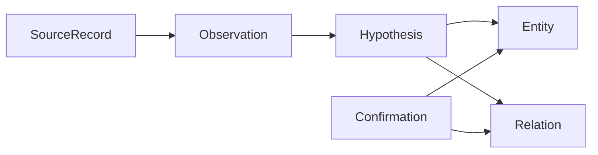
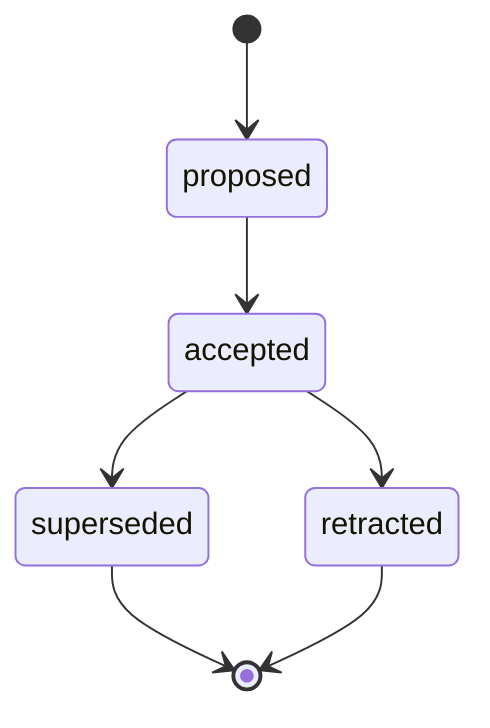
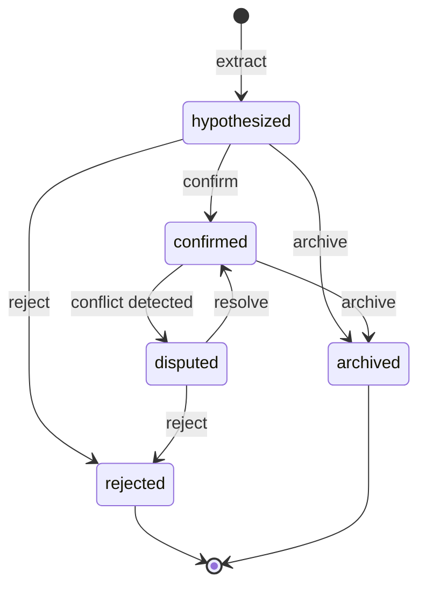

> **日本語版**（正本は英語: [knowledge-model.md](knowledge-model.ja.md)）。解釈が異なる場合は英語版を優先します。
>
> [English](knowledge-model.ja.md) | 日本語

<a id="knowledge-model"></a>

# 知識モデル

zenchi-zenno の正規知識オントロジーの詳細な仕様。

**関連:** [ARCHITECTURE.md](ARCHITECTURE.ja.md#5-knowledge-model) · [ユビキタス言語.md](ubiquitous-language.ja.md) · [schemas/entity.base.schema.json](../schemas/entity.base.schema.json)

---

<a id="overview"></a>

## 概要

zenchi-zenno の知識は、不変のソース資料から確認された正規エンティティに流れます。



---

<a id="entity-base-schema"></a>

## Entity 基本スキーマ

8 つのエンティティ タイプはすべて、共通のヘッダーを拡張します。

<a id="required-fields"></a>

### 必須フィールド

| フィールド           | タイプ             | 説明                                                        |
| -------------------- | ------------------ | ----------------------------------------------------------- |
| `id`                 | 文字列 (ULID/UUID) | 安定した識別子                                              |
| `workspace_id`       | 文字列             | 個人境界または Project 境界                                 |
| `type`               | 列挙型             | 8 つの標準タイプの 1 つ                                     |
| `title`              | 文字列             | 人間が読める短いラベル                                      |
| `status`             | 文字列             | タイプ固有のライフサイクル値                                |
| `confirmation_state` | 列挙型             | `hypothesized`、`confirmed`、`disputed`、`archived`         |
| `evidence_refs`      | 文字列[]           | Evidence レコード ID (確認されたエンティティの場合は最小 1) |
| `created_at`         | 日時               | システム作成時間                                            |
| `updated_at`         | 日時               | システムの最終更新時刻                                      |

<a id="optional-fields"></a>

### オプションのフィールド

| フィールド    | タイプ       | 説明                                                      |
| ------------- | ------------ | --------------------------------------------------------- |
| `summary`     | 文字列       | 現在の 1 段落の要約                                       |
| `sensitivity` | 列挙型       | `private`、`shareable`、`restricted`                      |
| `confidence`  | 番号         | 抽出由来の場合は 0.0 ～ 1.0                               |
| `valid_from`  | 日時         | 有効時間の開始                                            |
| `valid_to`    | 日時         | 有効時間の終了 (null = オープン)                          |
| `aliases`     | 文字列[]     | 代替表面形状                                              |
| `tags`        | 文字列[]     | 軽量ラベル                                                |
| `provenance`  | オブジェクト | `{ extractor, model, prompt_version, connector_version }` |
| `attributes`  | オブジェクト | タイプ固有のペイロード (以下を参照)                       |

---

<a id="entity-types"></a>

## Entity タイプ

<a id="decision"></a>

### Decision

**目的:** 単なる議論の結果ではなく、採用された選択を記録します。

| フィールド        | タイプ         | 必須   | 説明                                                 |
| ----------------- | -------------- | ------ | ---------------------------------------------------- |
| `rationale`       | 文字列         | はい   | このオプションが選択された理由                       |
| `alternatives`    | オブジェクト[] | いいえ | `{ title, summary, rejected_reason? }`               |
| `decided_at`      | 日時           | はい   | 決定が発効したとき                                   |
| `impact_scope`    | 文字列         | いいえ | 影響を受けるシステム、チーム、またはアーティファクト |
| `decision_makers` | 文字列[]       | いいえ | Person エンティティ ID                               |

**ステータスのライフサイクル:**



**典型的な証拠:** ADR、会議メモ、issue/PR コメント、明示的な Slack 結論。

---

<a id="idea"></a>

### Idea

**目的:** 検討中の概念や採用されなかった概念をキャプチャします。

| フィールド          | タイプ   | 必須   | 説明                           |
| ------------------- | -------- | ------ | ------------------------------ |
| `problem_frame`     | 文字列   | いいえ | 調査中の問題                   |
| `novelty_score`     | 番号     | いいえ | オプションのランキングシグナル |
| `related_interests` | 文字列[] | いいえ | Interest エンティティ ID       |

**ステータスのライフサイクル:** `captured` → `exploring` → `promoted` | `parked` | `discarded`

**プロモーション:** `promoted_to` 関係は Idea → Decision にリンクします。

---

<a id="project"></a>

### Project

**目的:** 限定された取り組みに関する関連知識のコンテナー。

| フィールド         | タイプ       | 必須   | 説明                             |
| ------------------ | ------------ | ------ | -------------------------------- |
| `goal`             | 文字列       | はい   | プロジェクトが目指すもの         |
| `timebox`          | オブジェクト | いいえ | `{ start, end? }`                |
| `success_criteria` | 文字列[]     | いいえ | 測定可能な基準または定性的な基準 |

**ステータスのライフサイクル:** `active` → `paused` | `completed` | `abandoned`

個人的な例: 「求人検索 2026」、「zenchi-zenno MVP」。

---

<a id="person"></a>

### Person

**目的:** 人間と安定したエージェントのアイデンティティを表します。

| フィールド        | タイプ         | 必須   | 説明                                             |
| ----------------- | -------------- | ------ | ------------------------------------------------ |
| `identity_keys`   | オブジェクト[] | いいえ | `{ kind, value }` 例:電子メール、github ハンドル |
| `roles_over_time` | オブジェクト[] | いいえ | `{ role, project_id?, valid_from, valid_to? }`   |

ソース間の ID 解決は、Confirmation まで常に Hypothesis です。

---

<a id="interest"></a>

### Interest

**目的:** トピックまたはドメインに対する持続的な注意。

| フィールド  | タイプ   | 必須   | 説明                                        |
| ----------- | -------- | ------ | ------------------------------------------- |
| `keywords`  | 文字列[] | いいえ | 表面用語                                    |
| `intensity` | 番号     | いいえ | 派生信号 (プロジェクションにおける時間減衰) |

**ステータスのライフサイクル:** `emerging` → `active` → `waning` → `archived`

関心は、`about` 関係を介して成果物、学習、およびイベントを引き付けます。

---

<a id="learning"></a>

### Learning

**目的:** 失敗から得た知識も含めて、得た知識を記録します。

| フィールド         | タイプ   | 必須   | 説明                         |
| ------------------ | -------- | ------ | ---------------------------- |
| `skill_or_concept` | 文字列   | はい   | 学んだこと                   |
| `competency_delta` | 文字列   | いいえ | 定性的または構造的な進歩     |
| `from_mistake`     | ブール値 | いいえ | 学習は誤りから生じたかどうか |

**ステータスのライフサイクル:** `noted` → `practiced` → `internalized`

---

<a id="artifact"></a>

### Artifact

**目的:** 耐久性のある出力とソースドキュメント。

| フィールド        | タイプ | 必須   | 説明                              |
| ----------------- | ------ | ------ | --------------------------------- |
| `media_type`      | 文字列 | はい   | MIME または論理タイプ             |
| `canonical_uri`   | 文字列 | いいえ | 安定した URI (利用可能な場合)     |
| `version_lineage` | 文字列 | いいえ | リビジョンの親アーティファクト ID |

**ステータスのライフサイクル:** `draft` → `active` → `deprecated` | `deleted_at_source`

Drive ドキュメントのリビジョンとその zenchi-zenno Artifact は、リビジョンごとに 1:1 になることも、系統内にグループ化されることもあります。

---

<a id="event-knowledge-entity"></a>

### Event (知識エンティティ)

**目的:** ユーザーの世界での時間制限のある出来事。

| フィールド            | タイプ   | 必須   | 説明                                         |
| --------------------- | -------- | ------ | -------------------------------------------- |
| `occurred_at`         | 日時     | はい   | それが起こったとき、または予定されていたとき |
| `duration`            | 期間     | いいえ | 長さがわかっている場合                       |
| `location_or_channel` | 文字列   | いいえ | ルーム、URL、Slack チャンネル、…             |
| `participants`        | 文字列[] | いいえ | Person エンティティ ID                       |

**ステータスのライフサイクル:** `scheduled` → `occurred` | `cancelled`

> **警告:** [event-model.md](event-model.ja.md) のドメイン イベントと混同しないでください。

---

<a id="relation-specification"></a>

## Relation 仕様

<a id="structure"></a>

### 構造

```text
Relation {
  id, workspace_id,
  predicate,          // typed enum
  from_id, to_id,
  confirmation_state,
  confidence?,
  evidence_refs[],
  valid_from?, valid_to?,
  created_at, updated_at
}
```

<a id="predicate-catalog"></a>

### 述語カタログ

| 述語              | から                        | へ                   | カーディナリティに関するメモ    |
| ----------------- | --------------------------- | -------------------- | ------------------------------- |
| `evidences`       | Evidence                    | Entity / Relation    | エンティティごとに多数の証拠    |
| `derived_from`    | Entity                      | Observation / Entity | 来歴チェーン                    |
| `about`           | Event / Artifact / Learning | Interest / Project   | 件名バインディング              |
| `produced`        | Person / Project            | Artifact             | 著者                            |
| `participated_in` | Person                      | Event                | 出席                            |
| `decides_for`     | Decision                    | Project / Artifact   | 適用性                          |
| `supersedes`      | Decision                    | Decision             | 一時的な置き換え                |
| `promoted_to`     | Idea                        | Decision             | Idea 卒業                       |
| `related_to`      | Entity                      | Entity               | 弱いリンク - 型付きの関係を好む |
| `mentions`        | Observation                 | Person / Artifact    | 抽出の言及                      |
| `learns`          | Person                      | Learning             | 学習内容                        |
| `contradicts`     | Entity / Claim              | Entity / Claim       | 紛争                            |
| `belongs_to`      | Entity                      | Project / Workspace  | 封じ込め                        |

---

<a id="observation-model"></a>

## Observation モデル

[schemas/observation.schema.json](../schemas/observation.schema.json) を参照してください。

観測値は実体ではありません**。これらは、Source Reality から正規の知識への橋渡しとなります。

<a id="observation-types-examples"></a>

### Observation タイプ (例)

| `source_type`     | 説明                                                  |
| ----------------- | ----------------------------------------------------- |
| `code.change`     | Git コミットまたは同等のもの                          |
| `code.review`     | PR レビュー スレッド                                  |
| `doc.revision`    | ドキュメントのバージョン                              |
| `meeting.notes`   | 会議のメモまたは記録                                  |
| `chat.thread`     | Slack/Discord スレッド                                |
| `chat.message`    | 単一のメッセージ (通常はスレッドにグループ化されます) |
| `calendar.event`  | カレンダーエントリー                                  |
| `email.message`   | 電子メール                                            |
| `ai.conversation` | ChatGPT または同様のエクスポート turn/session         |
| `media.view`      | YouTube またはメディア消費                            |
| `social.post`     | X またはソーシャル投稿                                |

---

<a id="source-mapping-reference"></a>

## ソースマッピングリファレンス

| 出典                 | Observation       | Entity 抽出ターゲット                             |
| -------------------- | ----------------- | ------------------------------------------------- |
| Git コミット         | `code.change`     | Artifact (repo/file)、Event、Learning?、Decision? |
| PR マージ            | `code.review`     | Decision (マージ)、Artifact、Person               |
| ドライブドキュメント | `doc.revision`    | Artifact、Idea、Decision                          |
| 会議メモ             | `meeting.notes`   | Event、Decision、Person、Project                  |
| Slack スレッド       | `chat.thread`     | Event、Idea、Decision (仮説)、Person              |
| カレンダー           | `calendar.event`  | Event、Person、Project                            |
| Gmail                | `email.message`   | Event、Person、Idea                               |
| ChatGPT エクスポート | `ai.conversation` | Idea、Learning、Decision (仮説)、Interest         |
| YouTube              | `media.view`      | Event、Interest、Learning                         |
| X                    | `social.post`     | Interest、Idea、Person                            |

---

<a id="extraction-and-confirmation-rules"></a>

## 抽出と確認のルール

<a id="rule-1-no-single-message-decisions"></a>

### ルール 1: 単一メッセージによる決定は禁止

単独のチャット メッセージは確認済み Decision にはなりません。必要とする：

- 同じスレッド内の観察を裏付ける、または
- 明示的な決定文言 (「私たちは決定しました」、「X で行きます」)、または
- 人間 Confirmation

<a id="rule-2-evidence-minimum-for-confirmed"></a>

### ルール 2: 確認済みの最小値は Evidence

確認されたエンティティには、Observation を指す `evidence_refs` エントリが少なくとも 1 つ必要です。

<a id="rule-3-supersession-over-mutation"></a>

### ルール 3: 突然変異よりもスーパーセッション

Decision が変更された場合は、`supersedes` を使用して新しい Decision を作成します。理由を黙って上書きしないでください。

<a id="rule-4-hypothesis-labeling-in-agent-output"></a>

### ルール 4: エージェント出力の Hypothesis ラベル付け

エージェントは、抽出した知識を提示するときに、`confirmation_state` を表示する必要があります。

---

<a id="confirmation-state-machine"></a>

## Confirmation ステート マシン



---

<a id="personal-project-extensions"></a>

## 個人用 → Project 拡張機能

| 拡張子          | 説明                                                                           |
| --------------- | ------------------------------------------------------------------------------ |
| `WorkspaceKind` | `personal` \| `project`                                                        |
| 必須のレビュー  | 特定の Decision タイプにはコラボレーター Confirmation                          | が必要です。 |
| PII 編集        | Person `identity_keys` ポリシーでフィルター                                    |
| サブタイプ      | `Requirement`、`Risk`、`ADR` を Decision または Artifact の特殊化として        |
| 共通の関心事    | Project レベルの Interest エンティティがワークスペースのメンバーに表示されます |

コア 8 タイプは、継続的に変更されません。
