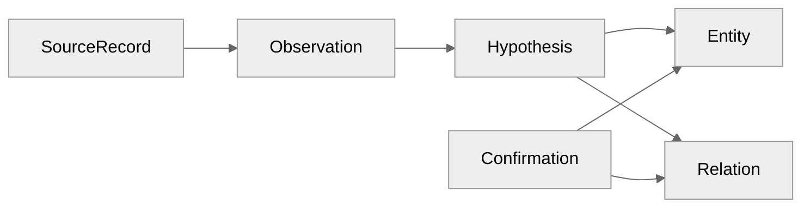
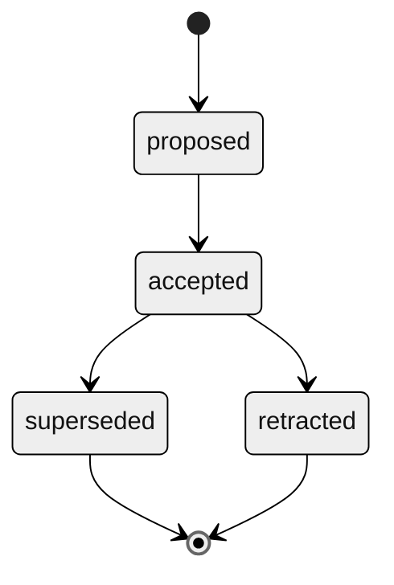
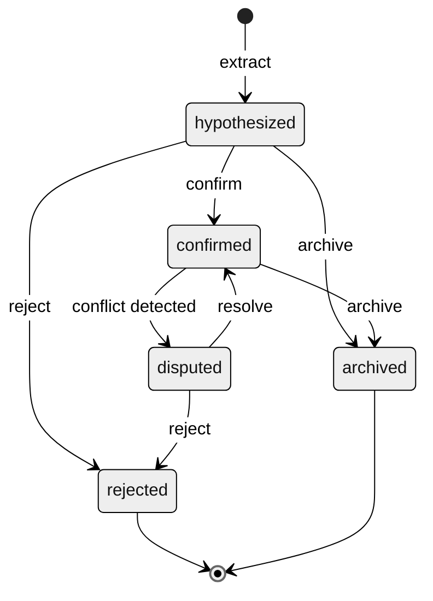

# Knowledge Model

English | [日本語](knowledge-model.ja.md)

Deep specification for zenchi-zenno's canonical knowledge ontology.

**Related:** [ARCHITECTURE.md](ARCHITECTURE.md#5-knowledge-model) · [ubiquitous-language.md](ubiquitous-language.md) · [schemas/entity.base.schema.json](../schemas/entity.base.schema.json)

---

## Overview

Knowledge in zenchi-zenno flows from immutable source material to confirmed canonical entities:



---

## Entity base schema

All eight entity types extend a common header.

### Required fields

| Field                | Type               | Description                                         |
| -------------------- | ------------------ | --------------------------------------------------- |
| `id`                 | string (ULID/UUID) | Stable identifier                                   |
| `workspace_id`       | string             | Personal or Project boundary                        |
| `type`               | enum               | One of eight canonical types                        |
| `title`              | string             | Short human-readable label                          |
| `status`             | string             | Type-specific lifecycle value                       |
| `confirmation_state` | enum               | `hypothesized`, `confirmed`, `disputed`, `archived` |
| `evidence_refs`      | string[]           | Evidence record IDs (min 1 for confirmed entities)  |
| `created_at`         | datetime           | System creation time                                |
| `updated_at`         | datetime           | System last update time                             |

### Optional fields

| Field         | Type     | Description                                               |
| ------------- | -------- | --------------------------------------------------------- |
| `summary`     | string   | Current one-paragraph summary                             |
| `sensitivity` | enum     | `private`, `shareable`, `restricted`                      |
| `confidence`  | number   | 0.0–1.0 when extraction-derived                           |
| `valid_from`  | datetime | Start of valid time                                       |
| `valid_to`    | datetime | End of valid time (null = open)                           |
| `aliases`     | string[] | Alternate surface forms                                   |
| `tags`        | string[] | Lightweight labels                                        |
| `provenance`  | object   | `{ extractor, model, prompt_version, connector_version }` |
| `attributes`  | object   | Type-specific payload (see below)                         |

---

## Entity types

### Decision

**Purpose:** Record an adopted choice, not merely a discussion outcome.

| Field             | Type     | Required | Description                            |
| ----------------- | -------- | -------- | -------------------------------------- |
| `rationale`       | string   | yes      | Why this option was chosen             |
| `alternatives`    | object[] | no       | `{ title, summary, rejected_reason? }` |
| `decided_at`      | datetime | yes      | When the decision took effect          |
| `impact_scope`    | string   | no       | Systems, teams, or artifacts affected  |
| `decision_makers` | string[] | no       | Person entity IDs                      |

**Status lifecycle:**



**Typical evidence:** ADRs, meeting notes, issue/PR comments, explicit Slack conclusions.

---

### Idea

**Purpose:** Capture exploring or unadopted concepts.

| Field               | Type     | Required | Description             |
| ------------------- | -------- | -------- | ----------------------- |
| `problem_frame`     | string   | no       | Problem being explored  |
| `novelty_score`     | number   | no       | Optional ranking signal |
| `related_interests` | string[] | no       | Interest entity IDs     |

**Status lifecycle:** `captured` → `exploring` → `promoted` | `parked` | `discarded`

**Promotion:** `promoted_to` relation links Idea → Decision.

---

### Project

**Purpose:** Container for related knowledge over a bounded initiative.

| Field              | Type     | Required | Description                        |
| ------------------ | -------- | -------- | ---------------------------------- |
| `goal`             | string   | yes      | What the project aims to achieve   |
| `timebox`          | object   | no       | `{ start, end? }`                  |
| `success_criteria` | string[] | no       | Measurable or qualitative criteria |

**Status lifecycle:** `active` → `paused` | `completed` | `abandoned`

Personal examples: "Job search 2026", "zenchi-zenno MVP".

---

### Person

**Purpose:** Represent humans and stable agent identities.

| Field             | Type     | Required | Description                                    |
| ----------------- | -------- | -------- | ---------------------------------------------- |
| `identity_keys`   | object[] | no       | `{ kind, value }` e.g. email, github handle    |
| `roles_over_time` | object[] | no       | `{ role, project_id?, valid_from, valid_to? }` |

Identity resolution across sources is always Hypothesis until Confirmation.

---

### Interest

**Purpose:** Sustained attention on a topic or domain.

| Field       | Type     | Required | Description                                  |
| ----------- | -------- | -------- | -------------------------------------------- |
| `keywords`  | string[] | no       | Surface terms                                |
| `intensity` | number   | no       | Derived signal (time-decayed in projections) |

**Status lifecycle:** `emerging` → `active` → `waning` → `archived`

Interests attract Artifacts, Learnings, and Events via `about` relations.

---

### Learning

**Purpose:** Record knowledge gained, including from failure.

| Field              | Type    | Required | Description                        |
| ------------------ | ------- | -------- | ---------------------------------- |
| `skill_or_concept` | string  | yes      | What was learned                   |
| `competency_delta` | string  | no       | Qualitative or structured progress |
| `from_mistake`     | boolean | no       | Whether learning arose from error  |

**Status lifecycle:** `noted` → `practiced` → `internalized`

---

### Artifact

**Purpose:** Durable outputs and source documents.

| Field             | Type   | Required | Description                      |
| ----------------- | ------ | -------- | -------------------------------- |
| `media_type`      | string | yes      | MIME or logical type             |
| `canonical_uri`   | string | no       | Stable URI if available          |
| `version_lineage` | string | no       | Parent artifact ID for revisions |

**Status lifecycle:** `draft` → `active` → `deprecated` | `deleted_at_source`

A Drive doc revision and its zenchi-zenno Artifact may be 1:1 per revision or grouped in a lineage.

---

### Event (knowledge entity)

**Purpose:** Time-bound occurrences in the user's world.

| Field                 | Type     | Required | Description                       |
| --------------------- | -------- | -------- | --------------------------------- |
| `occurred_at`         | datetime | yes      | When it happened or was scheduled |
| `duration`            | duration | no       | Length if known                   |
| `location_or_channel` | string   | no       | Room, URL, Slack channel, …       |
| `participants`        | string[] | no       | Person entity IDs                 |

**Status lifecycle:** `scheduled` → `occurred` | `cancelled`

> **Warning:** Do not confuse with Domain Events in [event-model.md](event-model.md).

---

## Relation specification

### Structure

```text
Relation {
  id, workspace_id,
  predicate,          // typed enum
  from_id, to_id,
  confirmation_state,
  confidence?,
  evidence_refs[],
  valid_from?, valid_to?,
  created_at, updated_at
}
```

### Predicate catalog

| Predicate         | From                        | To                   | Cardinality notes                  |
| ----------------- | --------------------------- | -------------------- | ---------------------------------- |
| `evidences`       | Evidence                    | Entity / Relation    | Many evidence per entity           |
| `derived_from`    | Entity                      | Observation / Entity | Provenance chain                   |
| `about`           | Event / Artifact / Learning | Interest / Project   | Subject binding                    |
| `produced`        | Person / Project            | Artifact             | Authorship                         |
| `participated_in` | Person                      | Event                | Attendance                         |
| `decides_for`     | Decision                    | Project / Artifact   | Applicability                      |
| `supersedes`      | Decision                    | Decision             | Temporal replacement               |
| `promoted_to`     | Idea                        | Decision             | Idea graduation                    |
| `related_to`      | Entity                      | Entity               | Weak link — prefer typed relations |
| `mentions`        | Observation                 | Person / Artifact    | Extraction mention                 |
| `learns`          | Person                      | Learning             | Subject of learning                |
| `contradicts`     | Entity / Claim              | Entity / Claim       | Conflict                           |
| `belongs_to`      | Entity                      | Project / Workspace  | Containment                        |

---

## Observation model

See [schemas/observation.schema.json](../schemas/observation.schema.json).

Observations are **not** entities. They are the bridge from Source Reality to canonical knowledge.

### Observation types (examples)

| `source_type`     | Description                                  |
| ----------------- | -------------------------------------------- |
| `code.change`     | Git commit or equivalent                     |
| `code.review`     | PR review thread                             |
| `doc.revision`    | Document version                             |
| `meeting.notes`   | Meeting notes or transcript                  |
| `chat.thread`     | Slack/Discord thread                         |
| `chat.message`    | Single message (usually grouped into thread) |
| `calendar.event`  | Calendar entry                               |
| `email.message`   | Email                                        |
| `ai.conversation` | ChatGPT or similar export turn/session       |
| `media.view`      | YouTube or media consumption                 |
| `social.post`     | X or social post                             |

---

## Source mapping reference

| Source         | Observation       | Entity extraction targets                         |
| -------------- | ----------------- | ------------------------------------------------- |
| Git commit     | `code.change`     | Artifact (repo/file), Event, Learning?, Decision? |
| PR merge       | `code.review`     | Decision (merge), Artifact, Person                |
| Drive doc      | `doc.revision`    | Artifact, Idea, Decision                          |
| Meeting notes  | `meeting.notes`   | Event, Decision, Person, Project                  |
| Slack thread   | `chat.thread`     | Event, Idea, Decision (hypothesis), Person        |
| Calendar       | `calendar.event`  | Event, Person, Project                            |
| Gmail          | `email.message`   | Event, Person, Idea                               |
| ChatGPT export | `ai.conversation` | Idea, Learning, Decision (hypothesis), Interest   |
| YouTube        | `media.view`      | Event, Interest, Learning                         |
| X              | `social.post`     | Interest, Idea, Person                            |

---

## Extraction and confirmation rules

### Rule 1: No single-message Decisions

A lone chat message does not become a confirmed Decision. Require:

- Corroborating observations in the same thread, or
- Explicit decision language ("we decided", "going with X"), or
- Human Confirmation

### Rule 2: Evidence minimum for Confirmed

Confirmed entities must have at least one `evidence_refs` entry pointing to an Observation.

### Rule 3: Supersession over mutation

When a Decision changes, create a new Decision with `supersedes` — do not silently overwrite rationale.

### Rule 4: Hypothesis labeling in agent output

Agents must surface `confirmation_state` when presenting extracted knowledge.

---

## Confirmation state machine



---

## Personal → Project extensions

| Extension        | Description                                                          |
| ---------------- | -------------------------------------------------------------------- |
| `WorkspaceKind`  | `personal` \| `project`                                              |
| Mandatory review | Certain Decision types require collaborator Confirmation             |
| PII redaction    | Person `identity_keys` filtered by policy                            |
| Subtypes         | `Requirement`, `Risk`, `ADR` as Decision or Artifact specializations |
| Shared Interests | Project-level Interest entities visible to workspace members         |

Core eight types remain unchanged across the continuum.
